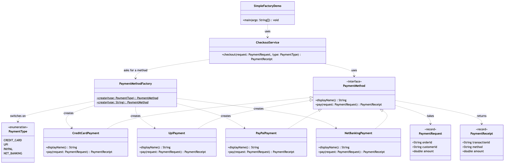

# Simple Factory Pattern

Demonstrates the **Simple Factory** creational idiom using an e-commerce
payment selection as an example.

- `PaymentMethod` — the sealed product interface every payment method
  implements.
- `CreditCardPayment`, `UpiPayment`, `PayPalPayment`, `NetBankingPayment` —
  the concrete products, each doing its own specialised work.
- `PaymentMethodFactory` — a single `create(...)` method that turns a
  `PaymentType` (or a `String` from a form) into the right implementation.
  It is the only class in the project that calls `new` on a payment method.
- `PaymentRequest` / `PaymentReceipt` — simple value objects passed to and
  returned from a payment method.
- `CheckoutService` — the client; it names a type and uses the result purely
  through the interface.
- `SimpleFactoryDemo` — runnable entry point that pays for the same order
  four different ways.

## Run

```bash
./gradlew run
```

## Test

```bash
./gradlew test
```

## Learning Material

Start here if you are new to the pattern — the docs are ordered as a
learning path.

| Document | What it covers |
| --- | --- |
| [`docs/prerequisites.md`](docs/prerequisites.md) | What to know and install before you start |
| [`docs/problem-statement.md`](docs/problem-statement.md) | The problem the pattern solves, and why the naive approach hurts |
| [`docs/simple-factory-pattern-explained.md`](docs/simple-factory-pattern-explained.md) | The pattern itself, the code walked through, pitfalls, and comparisons |
| [`docs/class-diagram.md`](docs/class-diagram.md) | Static structure |
| [`docs/uml-diagram.md`](docs/uml-diagram.md) | Runtime call flow |
| [`docs/animation.html`](docs/animation.html) | Animated, step-by-step walkthrough — open in a browser. Optional narration via the **Narration** button |
| [`docs/session.md`](docs/session.md) | A 60-minute guided session plan for teaching it |
| [`video/`](video/) | A narrated ~7.5 minute video, plus the script and build pipeline |

### The pattern in one picture



### Video

`video/simple-factory-pattern-explained.mp4` — 1080p, ~7.5 minutes, narrated.
An audio-only version is alongside it. See
[`video/README.md`](video/README.md) to rebuild or re-record it.

### Related

[`../../structural/facade-pattern`](../../structural/facade-pattern) — the Facade pattern, built the
same way. Facade is *structural* (simplifying how things are used); Simple
Factory is *creational* (deciding what gets built).
