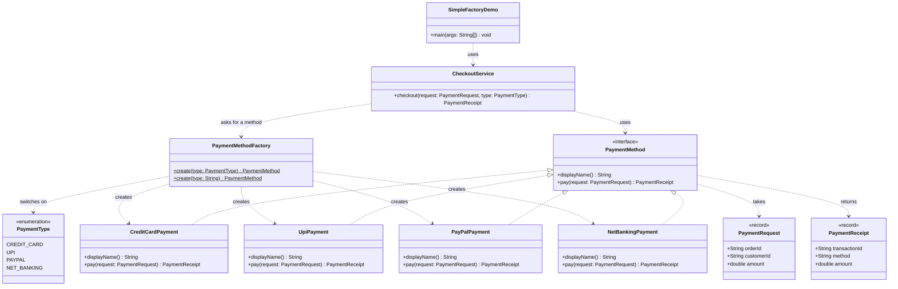

# Simple Factory Pattern — Class Diagram

Shows the static structure: `CheckoutService` depends only on the
`PaymentMethod` interface and on `PaymentMethodFactory`. The four concrete
payment methods are known to the factory alone.

Mermaid source

## Notes

- `PaymentMethodFactory` is the **factory**: a single class holding one
  `switch` that turns a `PaymentType` into a concrete `PaymentMethod`. It is
  the only place in the codebase that calls `new` on a payment class.
- `PaymentMethod` is the **product interface**. It is `sealed`, so the
  compiler knows the full set of implementations and the factory's `switch`
  needs no `default` branch — miss a case and the build fails.
- `CheckoutService` is the **client**. Notice the arrows: it points at the
  interface and the factory, never at `CreditCardPayment` and friends. Add a
  fifth payment method and this class does not change.
- The dotted arrows out of the factory (`..>`) are the concrete dependencies
  the client no longer has. The pattern does not delete that coupling — it
  moves it into one class you can find and edit.
- `PaymentRequest` and `PaymentReceipt` are immutable `record` value objects
  passed to and returned from a payment method.
