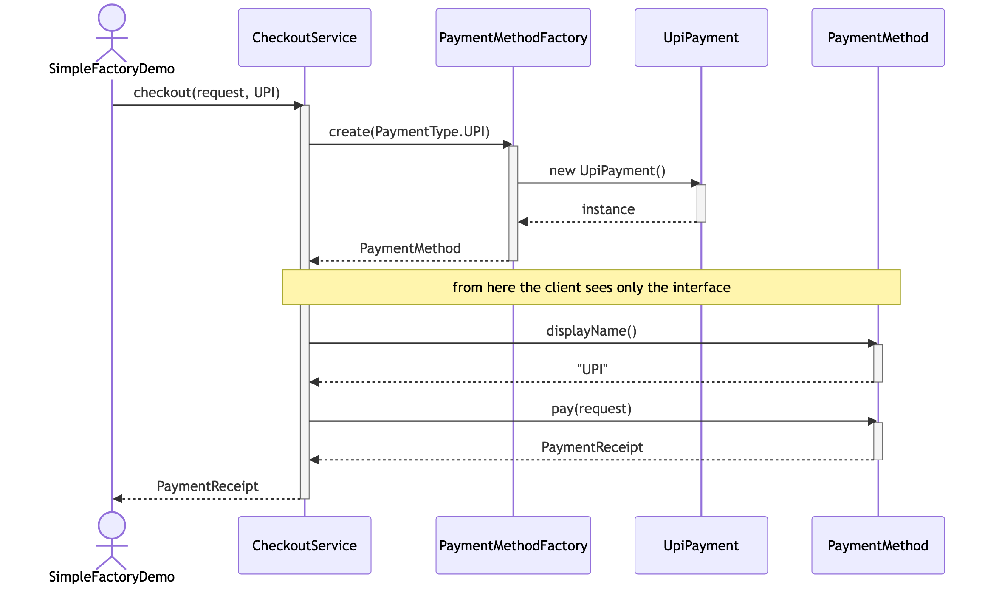
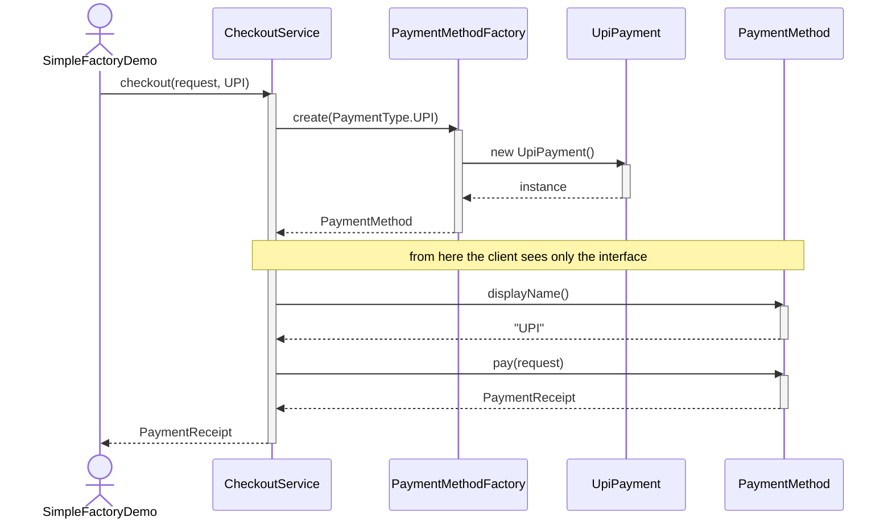

# Simple Factory Pattern — UML Sequence Diagram

Shows the runtime interaction: the client asks the factory for a payment
method, then talks to whatever came back purely through the interface.

Mermaid source

## Notes

- There are two distinct phases. **Creation** happens once, inside the
  factory. **Use** happens afterwards, entirely through the `PaymentMethod`
  interface.
- `CheckoutService` never writes `new UpiPayment()`. It hands the factory a
  `PaymentType` and receives something it only knows as a `PaymentMethod`.
- Swap `PaymentType.UPI` for `PaymentType.PAYPAL` and every arrow after the
  factory call is identical — a different object arrives, the conversation
  does not change. That is polymorphism doing the work; the factory just
  decides who shows up.
- The factory is a plain static method call, not an object the client holds.
  That is what makes this *Simple* Factory rather than Factory Method: there
  is no inheritance and nothing to subclass.
