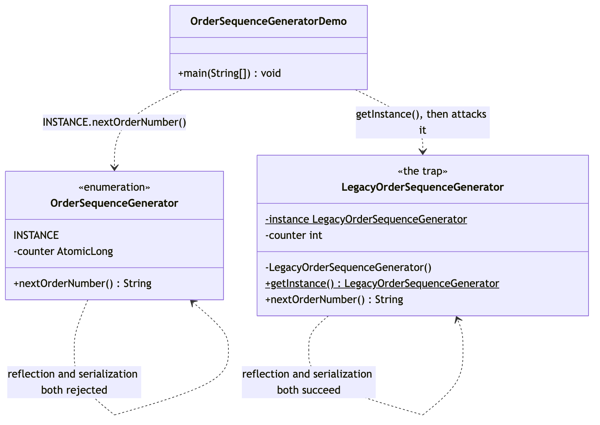

# Singleton Pattern

Demonstrates the **singleton pattern** — a Gang of Four creational pattern —
using an order-number sequencer that checkout, the admin console, and a
background retry job all have to share: two different customers must never
receive the same order number.

It deliberately builds the classic shape first — a private constructor, a
static field, and a public `getInstance()` — and then breaks it twice, with
reflection and with serialization, before landing on the shape *Effective
Java* Item 3 actually recommends: a single-element `enum`.

- `OrderSequenceGenerator` — the fix. A single-element `enum` whose one
  constant, `INSTANCE`, is created exactly once by the JVM during class
  loading. Reflection cannot construct a second enum instance —
  `Constructor.newInstance()` rejects enum types outright — and enum
  deserialization resolves by constant *name* against the existing instance
  rather than rebuilding one from bytes. Its counter is an `AtomicLong`,
  because a true singleton is reachable from every thread at once.
- `LegacyOrderSequenceGenerator` — the trap. The textbook private-constructor
  singleton, identical to callers under normal use, but with two real holes:
  `setAccessible(true)` calls its "private" constructor anyway, and a plain
  serialization round trip rebuilds a second instance with no reflection
  needed at all.
- `OrderSequenceGeneratorDemo` — runnable entry point: proves both classes
  behave the same way under normal use, then runs both attacks against both
  classes side by side so the outcomes can be compared directly.

The point in one line: a private constructor is a promise the compiler
checks, not one the JVM enforces at runtime — a single-element `enum` is the
one Java singleton shape that closes both holes, for free.

## Run

```bash
./gradlew run
```

Which prints:

```text
== The fix: an enum singleton ==
first == second: true
ORD-000001
ORD-000002
ORD-000003  (issued from 'second', same counter)

== Attacking it: reflection ==
Rejected: Cannot reflectively create enum objects

== Attacking it: serialization ==
roundTripped == INSTANCE: true

== The trap: a classic private-constructor singleton ==
legacyFirst == legacySecond: true
ORD-000001
ORD-000002

== Breaking it: reflection ==
forged == legacyFirst: false
forged's first order number: ORD-000001  (a duplicate of one already issued above)

== Breaking it: serialization ==
legacyRoundTripped == legacyFirst: false
```

## Test

```bash
./gradlew test
```

Ten tests, covering shared-instance identity, order-number format and
uniqueness, and concurrent uniqueness under 20 threads for the enum; and
shared-instance identity under normal use but a genuine second instance under
reflection and under deserialization for the legacy class.

## Learning Material

Start here if you are new to the technique — the docs are ordered as a
learning path.

| Document | What it covers |
| --- | --- |
| [`docs/prerequisites.md`](docs/prerequisites.md) | What to know and install before you start |
| [`docs/problem-statement.md`](docs/problem-statement.md) | The problem, starting from an instance-per-caller collision through the classic fix's two holes |
| [`docs/singleton-pattern-explained.md`](docs/singleton-pattern-explained.md) | The technique, the code walked through, and where it stops paying off |
| [`docs/class-diagram.md`](docs/class-diagram.md) | Static structure — the enum and the trap, side by side |
| [`docs/uml-diagram.md`](docs/uml-diagram.md) | Runtime call flow — both attacks, run against both classes |
| [`docs/animation.html`](docs/animation.html) | Animated, step-by-step walkthrough — open in a browser. Optional narration via the **Narration** button |
| [`docs/session.md`](docs/session.md) | A 45-minute guided session plan for teaching it |
| [`docs/video-spec.md`](docs/video-spec.md) | The specification the teaching video is built to — outputs, slide system, narration rules, and how to port it to another project |
| [`docs/youtube.md`](docs/youtube.md) | Title, description, chapters and thumbnail for publishing the video |
| [`docs/thumbnail.png`](docs/thumbnail.png) | The 1280×720 image to upload as the YouTube thumbnail |
| [`docs/spec.md`](docs/spec.md) | The project specification — problem, code, video and publishing quality bar. Also as [`spec.html`](docs/spec.html) |
| [`video/`](video/) | A narrated ~7.5 minute video, plus the script and build pipeline |

### The pattern in one picture



### Video

`video/singleton-pattern-explained.mp4` — 1080p, ~7.5 minutes, narrated. An
audio-only version is alongside it. See [`video/README.md`](video/README.md)
to rebuild or re-record it.

### Related

1. [`../static-factory-pattern`](../static-factory-pattern) — fixes an
   unreadable *single* call by naming and hiding a constructor.
2. [`../builder-pattern`](../builder-pattern) — assembles one object
   gradually, from nothing, a piece at a time.
3. [`../prototype-pattern`](../prototype-pattern) — "I already have one of
   these — how do I get another that's almost the same?"
4. [`../abstract-factory-pattern`](../abstract-factory-pattern) — one choice
   producing a whole matching *set* of objects.

Prototype, Builder and Abstract Factory all answer some version of "how
should this object be assembled?". Singleton asks a different question
entirely: "how many of this should ever exist?" — and is also the pattern
most often reached for to solve a different problem, "I don't want to pass
this object around", which dependency injection solves without the
global-state cost.

## Also available with a framework

[Singleton with Spring Pattern](../singleton-with-spring-pattern) reruns this idea on a real framework, and shows what the framework adds and where it can undo the pattern. Watch this project first.
