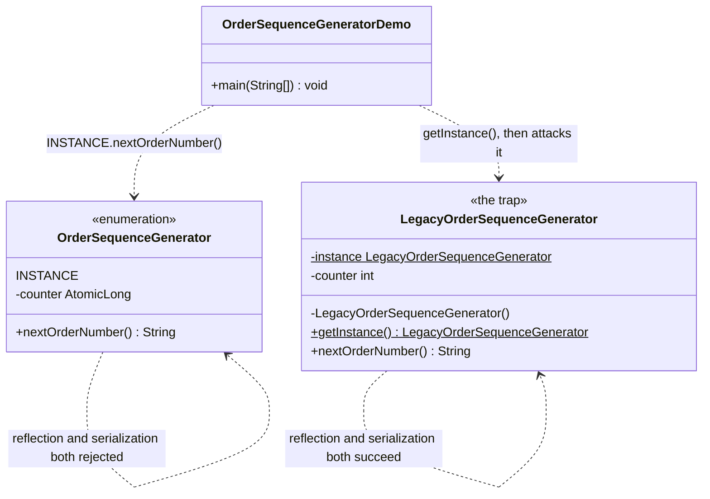
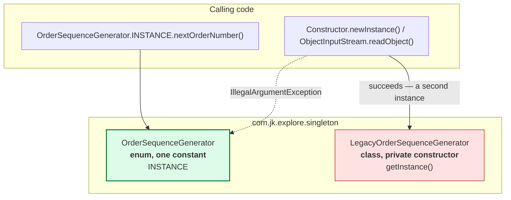

# Singleton Pattern — Class Diagram

## The structure

Mermaid source

The shape to notice: `OrderSequenceGenerator` has no `getInstance()` method
and no private constructor to guard, because an `enum` constant is not
constructed by ordinary code at all — `INSTANCE` is a field the compiler
generates and initializes exactly once, during class loading.
`LegacyOrderSequenceGenerator` has the shape every singleton tutorial
teaches first — a private constructor, a static field, a public accessor —
and every one of those three pieces is a place a guarantee can leak.

## What the caller can see

Mermaid source

## Notes

- There is no interface in this project's main flow the way `Prototype<T>`
  anchors the prototype-pattern project — the pattern here is entirely
  about controlling instantiation of one concrete type, not about a shared
  contract implemented by several types.
- `LegacyOrderSequenceGenerator` implements `Serializable` specifically so
  its deserialization flaw can be demonstrated. A class that never expects
  to be serialized would not need that interface at all, but plenty of
  real singletons pick it up accidentally by extending or implementing
  something that already does.
- Compare with
  [`../../prototype-pattern/docs/class-diagram.md`](../../prototype-pattern/docs/class-diagram.md).
  There, the interesting arrow is one type sharing a reference across
  copies of itself. Here, the interesting fact is the *absence* of an arrow
  — nothing else in the program is ever allowed to hold a second
  `OrderSequenceGenerator`.
