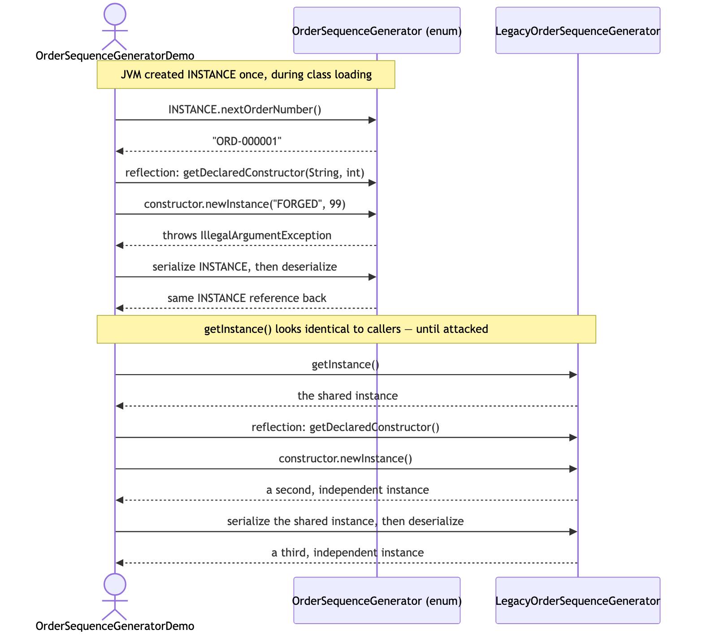
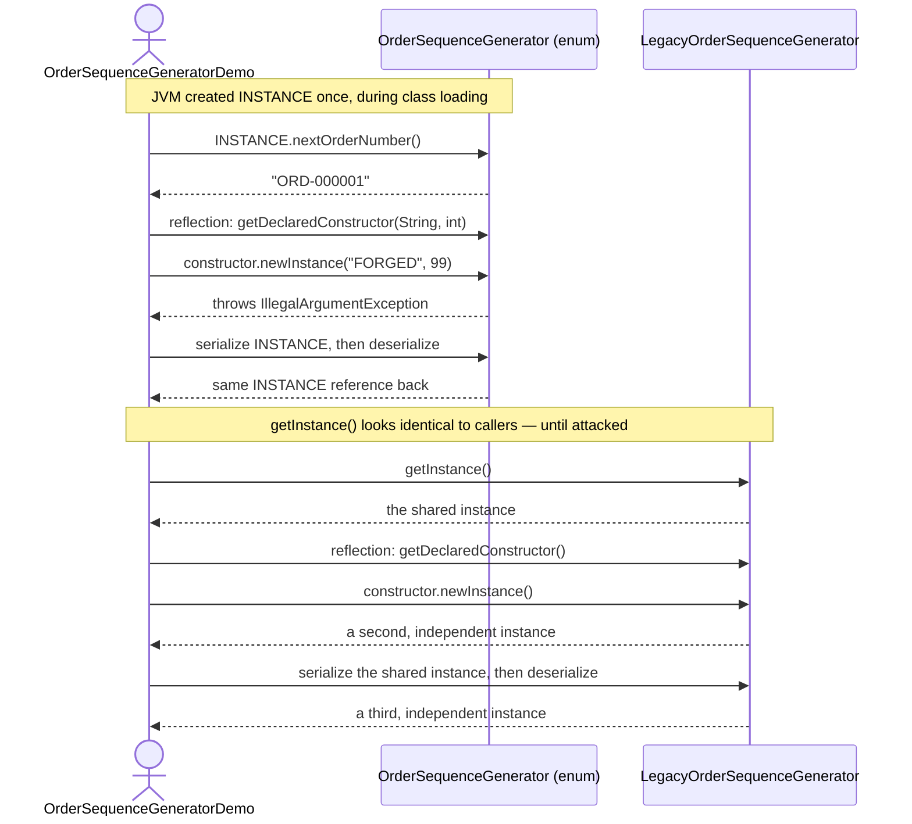

# Singleton Pattern — UML Sequence Diagram

Shows two runtime flows side by side: the enum singleton rejecting both
attacks, and the classic private-constructor shape falling to both.

Mermaid source

## Notes

- The two flows are drawn together deliberately: the calls a well-behaved
  client makes (top three arrows on each participant) are identical in
  shape. The difference only appears once something adversarial —
  reflection, serialization — is thrown at each one.
- `OrderSequenceGenerator.INSTANCE` never appears on the right-hand side of
  an assignment inside this project's own code. It cannot; there is no
  constructor call to make one.
- Compare with
  [`../../prototype-pattern/docs/uml-diagram.md`](../../prototype-pattern/docs/uml-diagram.md).
  There, the interesting sequence is one object producing a second,
  independent one on purpose. Here, the interesting sequence is an attempt
  to produce a second instance *despite* the type actively working to
  prevent it.
