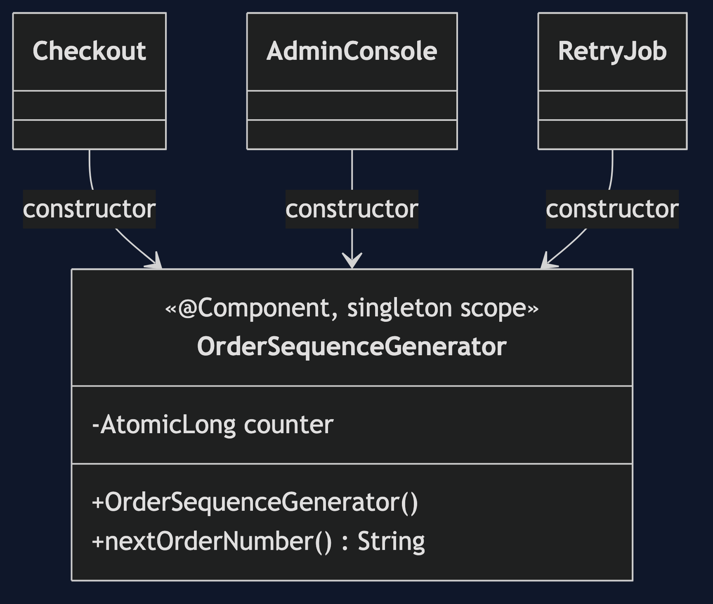

# Singleton with Spring Pattern

```
src/main/java/com/jk/explore/singletonspring/
├── ShopApplication.java             the Spring Boot entry point and the six acts
├── OrderSequenceGenerator.java      the bean: a public constructor and an AtomicLong
├── UnsafeOrderSequence.java         a plain-long counter, for act six
├── Checkout.java  AdminConsole.java  RetryJob.java    the three callers
└── Gate.java                        holds one thread between read and write
```

**In Spring a singleton is a scope, not a class shape: one instance per container, and only as safe as the code inside it.**

This project is the framework version of [Singleton](../singleton-pattern). That project built the mechanism by hand. This one shows the same idea inside Spring Boot. It does not re-teach the pattern. It shows what Spring Boot adds, the failures that are its own, and what it costs.

## Run

```bash
./gradlew run
```

Six acts. The partner project, Singleton, built the mechanism by hand. Here the same idea runs through Spring Boot, and every count comes from real output.

```
ONE. One bean, shared.
  checkout, admin and retry hold the same generator: true
  ORD-000001
  ORD-000002
  ORD-000003  (three callers, one counter)
TWO. Nothing stops new.
  managed says ORD-000001, a plain new says ORD-000001
  same object: false. the constructor is public, so the compiler cannot help.
THREE. One per container, not one per JVM.
  context A issues ORD-000001, context B issues ORD-000001
  the same order number went to two customers: true
FOUR. A scope change flips the answer.
  with scope prototype: checkout issues ORD-000001, admin issues ORD-000001
  one word changed, and the two callers no longer share a counter.
FIVE. When is it built?
  eager: built 1 before any caller asked.
  lazy: built 0 after startup.
  lazy: built 1 after the first caller.
SIX. Shared means shared by every thread.
  a plain long, held between read and write: ORD-000001 and ORD-000001
  duplicate order number: true
  an AtomicLong, 4 threads x 2500: 10000 distinct numbers, none repeated.
  Spring shares the bean. Keeping its state safe is still your job.
```

## Test

```bash
./gradlew test
```

2 test classes, 8 test methods, offline, with each Spring context started inside the test, and no server.

## Technologies and versions

| What | Version | Why it is here |
| --- | --- | --- |
| Java | 21 | The repository standard, via the Gradle toolchain block |
| Gradle | 9.2.1 | The wrapper in this directory; no separate install needed |
| Spring Boot | 4.1.1 | The container and its scopes |
| JUnit 5 | 5.10.2 | Test runner |

See [`docs/dependencies.md`](docs/dependencies.md).

## Learning Material

| Document | What it covers |
| --- | --- |
| [`docs/problem-statement.md`](docs/problem-statement.md) | The partner's sequencer, and what is new |
| [`docs/singleton-with-spring-pattern-explained.md`](docs/singleton-with-spring-pattern-explained.md) | One per container, and how it weakens |
| [`docs/class-diagram.md`](docs/class-diagram.md) | The types |
| [`docs/architecture-diagram.md`](docs/architecture-diagram.md) | Three callers, one bean, one container |
| [`docs/data-flow-diagram.md`](docs/data-flow-diagram.md) | Where a second instance can come from |
| [`docs/sequence-diagram.md`](docs/sequence-diagram.md) | Written for a listener with the screen off |
| [`docs/uml-diagram.md`](docs/uml-diagram.md) | Four sequences |
| [`docs/animation.html`](docs/animation.html) | The six acts in a browser |
| [`docs/prerequisites.md`](docs/prerequisites.md) | What you need to know |
| [`docs/session.md`](docs/session.md) | A one-hour taught session |
| [`docs/spec.md`](docs/spec.md) | The generated specification |
| [`docs/youtube.md`](docs/youtube.md) | Title, description and chapters |
| [`docs/dependencies.md`](docs/dependencies.md) | What Spring Boot is, what it costs, and that skipping this project loses none of the pattern |

### The pattern in one picture



### Where each piece sits


### How one request moves


### Who calls whom, in order


### All four sequences


### Video

Built from [`video/scenes.py`](video/scenes.py) by
[`video/build_video.sh`](video/build_video.sh). The rendered file is not
committed; see the repository README for why.

## Where you have already met this

Every `@Service` and `@Repository` you have written. The default scope is singleton, so most of them already are.

## When this is too much

For a class with no state, the singleton question hardly matters. It bites when the bean holds a counter, a cache or a connection.

## Where this sits

This project pairs with [Singleton](../singleton-pattern), and is a framework version in [`creational`](..).
