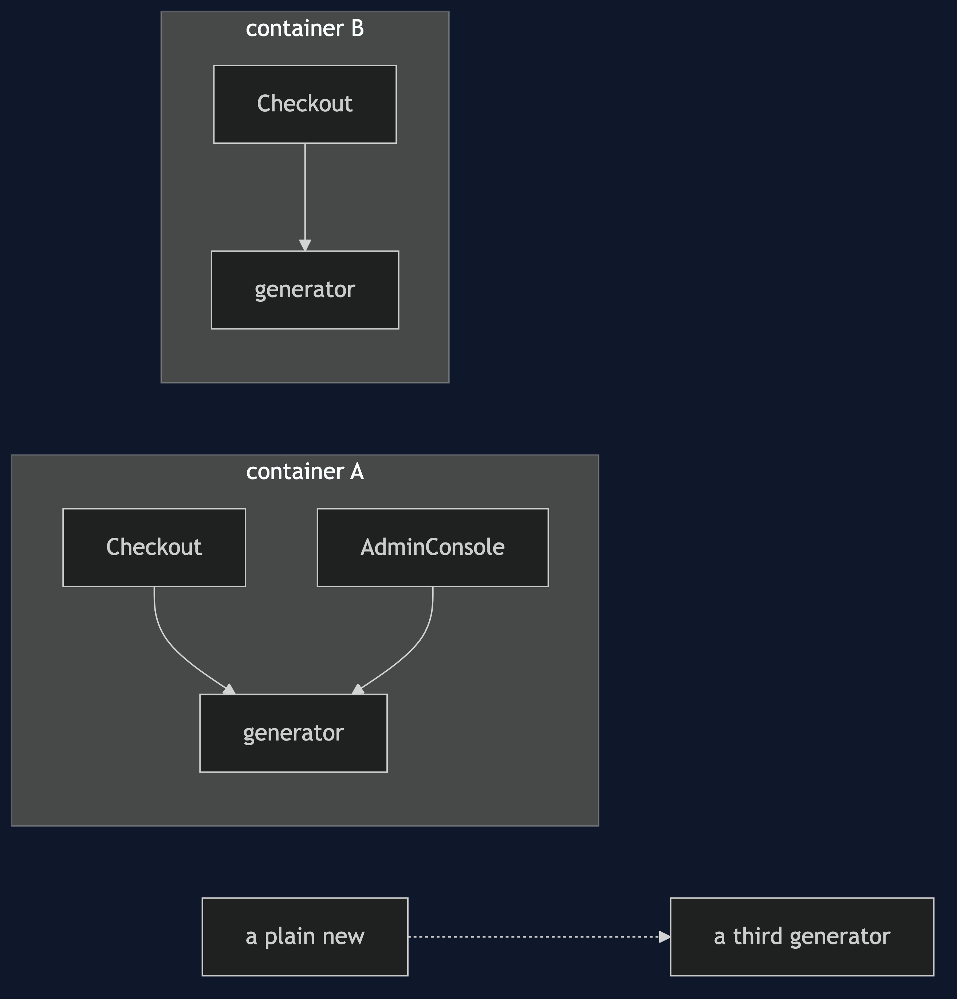
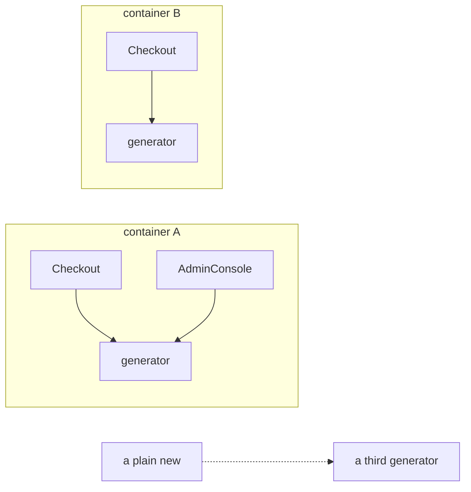

# Singleton with Spring Pattern — Architecture Diagram

One container holds one generator. A second container holds its own.

Mermaid source

```mermaid
flowchart LR
    subgraph A["container A"]
        C1["Checkout"] --> G1["generator"]
        M1["AdminConsole"] --> G1
    end
    subgraph B["container B"]
        C2["Checkout"] --> G2["generator"]
    end
    N["a plain new"] -.-> G3["a third generator"]
```

