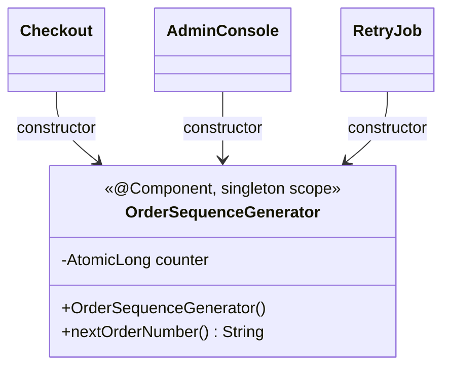

# Singleton with Spring Pattern — Class Diagram

`OrderSequenceGenerator` is an ordinary class. Three callers receive it by constructor.

Mermaid source

```mermaid
classDiagram
    class OrderSequenceGenerator {
        <<@Component, singleton scope>>
        -AtomicLong counter
        +OrderSequenceGenerator()
        +nextOrderNumber() String
    }
    class Checkout
    class AdminConsole
    class RetryJob
    Checkout --> OrderSequenceGenerator : constructor
    AdminConsole --> OrderSequenceGenerator : constructor
    RetryJob --> OrderSequenceGenerator : constructor
```

