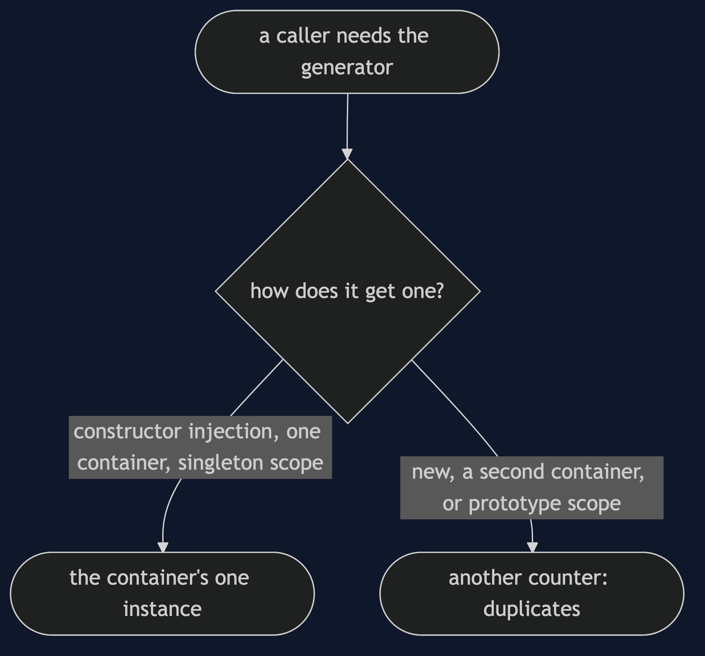
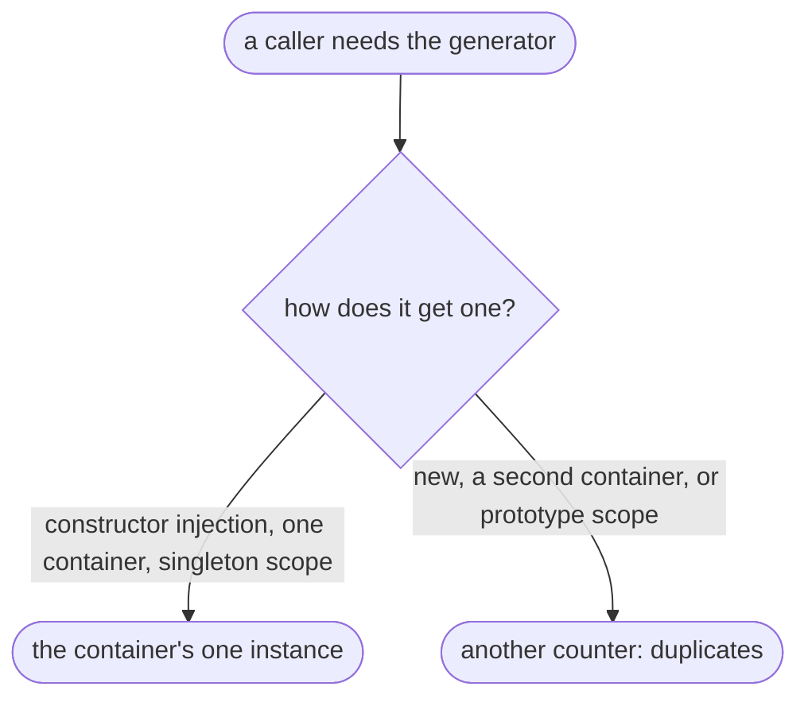

# Singleton with Spring Pattern — Data Flow Diagram

Where a second instance can come from.

Mermaid source

```mermaid
flowchart TD
    Ask(["a caller needs the generator"])
    How{"how does it get one?"}
    Same(["the container's one instance"])
    Other(["another counter: duplicates"])
    Ask --> How
    How -- constructor injection, one container, singleton scope --> Same
    How -- new, a second container, or prototype scope --> Other
```

