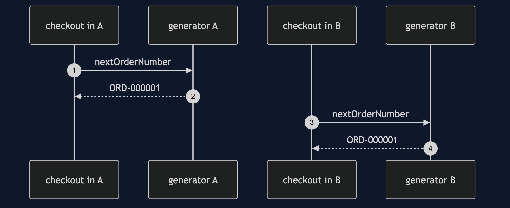
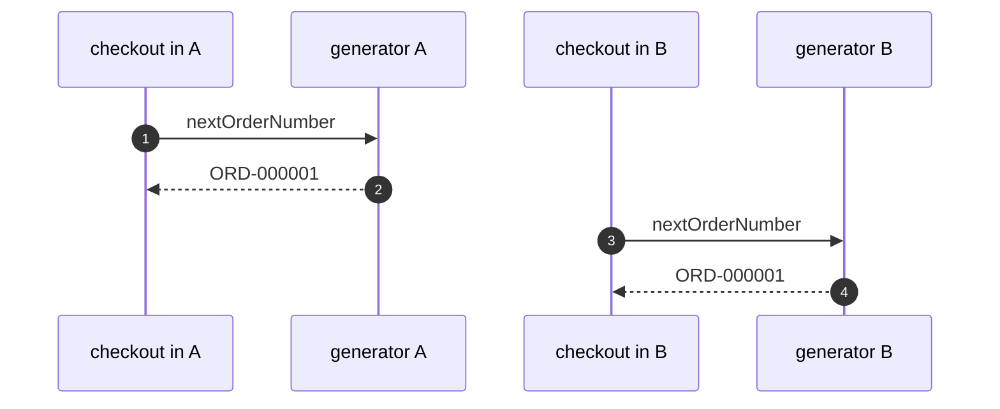

# Singleton with Spring Pattern — Sequence Diagram

Written for a listener with the screen off.

Say it in words. Two containers are started in the same program. The checkout in container A asks its generator for a number and gets order one. The checkout in container B asks its own generator, a different object, and also gets order one. Two customers hold the same order number.

Mermaid source

The load-bearing sentence: **the guarantee stops at the edge of the container.**
