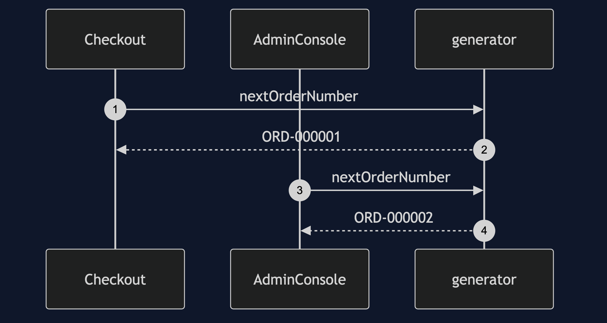
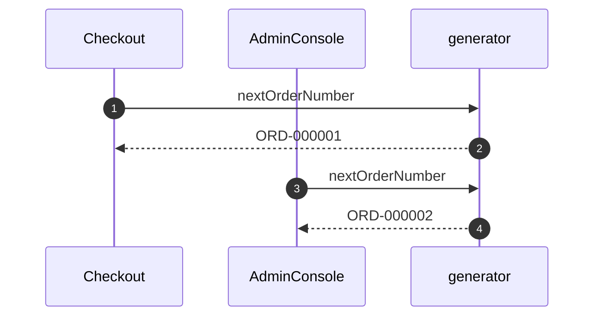
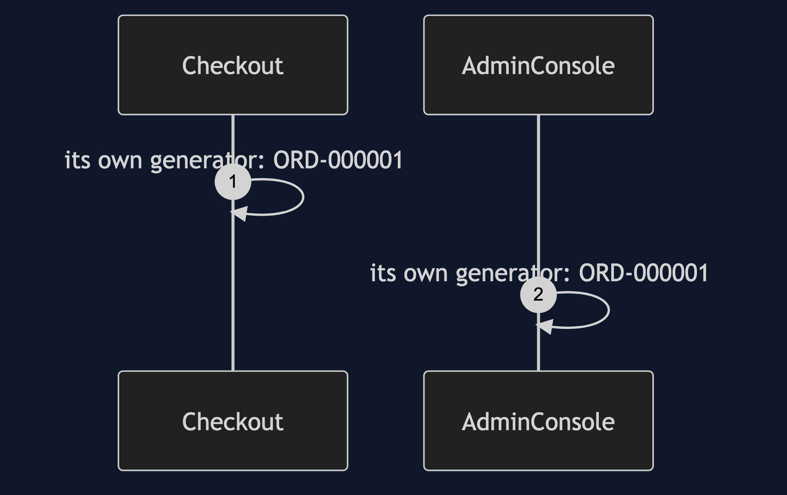
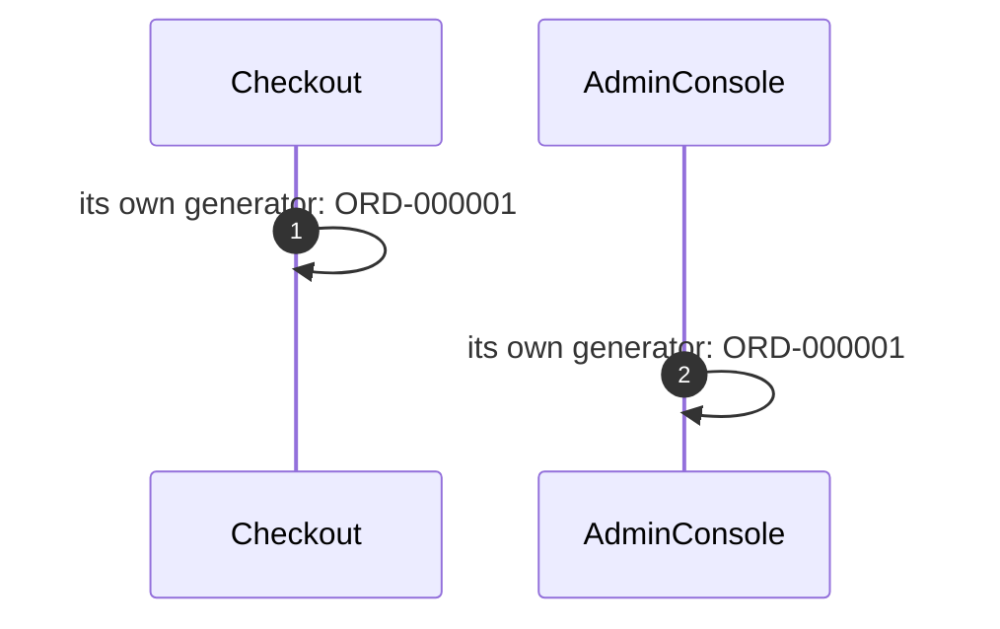
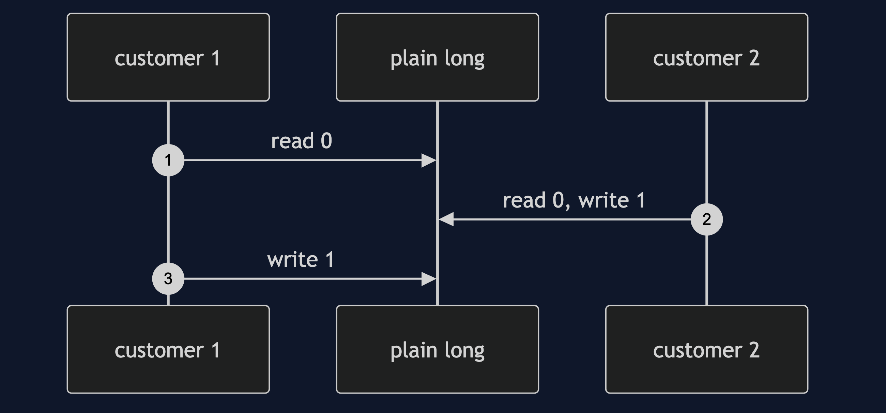
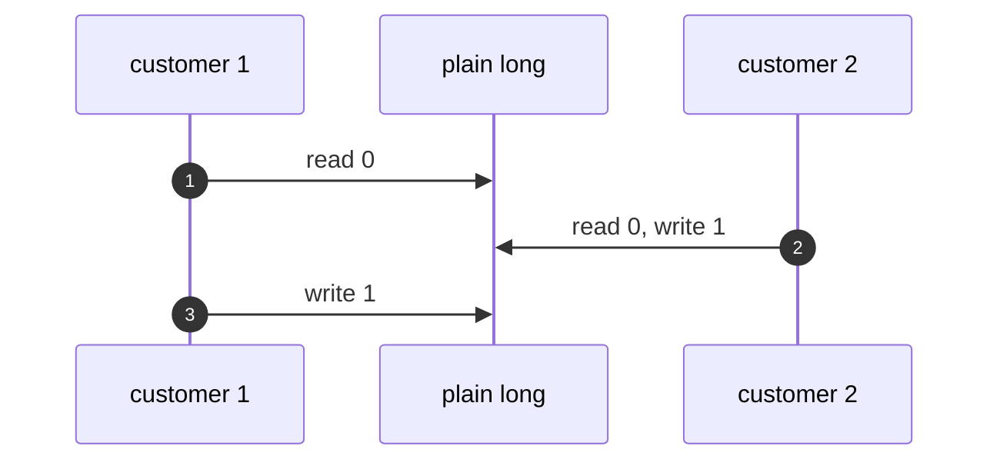

# Singleton with Spring Pattern — UML Sequence Diagrams

Four sequences.

## 1. One Bean Shared

Mermaid source

## 2. A Scope Change

Mermaid source

## 3. A Forced Duplicate

Mermaid source

