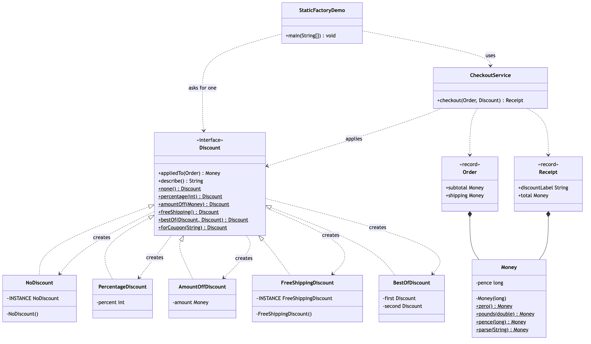
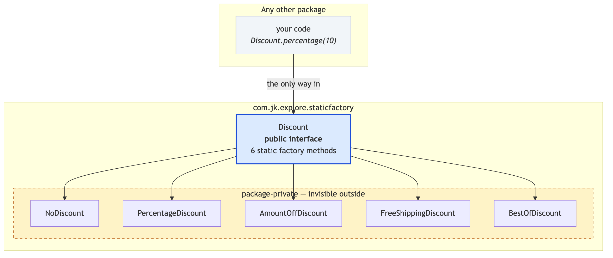

# Static Factory Method

Demonstrates the **static factory method** — Item 1 of *Effective Java*, and
the most-used creational technique in the language — using discounts on an
e-commerce order.

It is not a Gang of Four pattern, and it is not the same thing as Factory
Method despite the name. It is, however, where creation problems should start,
and the other three projects in this folder are what you graduate to.

- `Discount` — a public interface with six **static factory methods**:
  `none()`, `percentage(int)`, `amountOff(Money)`, `freeShipping()`,
  `bestOf(...)` and `forCoupon(String)`. The type is its own factory. There is
  no separate factory class anywhere in the project.
- `NoDiscount`, `PercentageDiscount`, `AmountOffDiscount`,
  `FreeShippingDiscount`, `BestOfDiscount` — the five implementations. Not one
  of them is `public`, so no code outside the package can name them.
- `Money` — the same idea on a value type. Private constructor;
  `Money.pounds(2.50)` and `Money.pence(250)` are the same amount reached by
  two differently named doors, which no pair of constructors could have been.
- `CheckoutService` — the client. It applies whatever discount it is handed.
  No `new`, no `if`, no mention of any implementation class.
- `Order` / `Receipt` — plain records. They have nothing to decide, so a
  constructor is right for them, and the contrast is deliberate.
- `StaticFactoryDemo` — runnable entry point that prices one order under five
  coupon codes, then proves the two things a constructor cannot do.

The point in one line: `Discount.percentage(0)` hands you back the shared
do-nothing discount instead of a percentage discount of zero — and nothing in
your code can tell, because your code never knew the class names to begin
with.

## Run

```bash
./gradlew run
```

## Test

```bash
./gradlew test
```

Thirty-four tests, covering the naming, the shared instances, the substituted
classes and the hidden implementations.

## Learning Material

Start here if you are new to the technique — the docs are ordered as a
learning path.

| Document | What it covers |
| --- | --- |
| [`docs/prerequisites.md`](docs/prerequisites.md) | What to know and install before you start |
| [`docs/problem-statement.md`](docs/problem-statement.md) | The problem, starting from a constructor that will not compile |
| [`docs/static-factory-pattern-explained.md`](docs/static-factory-pattern-explained.md) | The technique, the code walked through, naming conventions, and the costs |
| [`docs/class-diagram.md`](docs/class-diagram.md) | Static structure, and the package boundary |
| [`docs/uml-diagram.md`](docs/uml-diagram.md) | Runtime call flow |
| [`docs/animation.html`](docs/animation.html) | Animated, step-by-step walkthrough — open in a browser. Optional narration via the **Narration** button |
| [`docs/session.md`](docs/session.md) | A 60-minute guided session plan for teaching it |
| [`video/`](video/) | A narrated ~10 minute video, plus the script and build pipeline |

### The pattern in one picture



### What the caller can see



### Video

`video/static-factory-pattern-explained.mp4` — 1080p, ~10 minutes, narrated.
An audio-only version is alongside it. See
[`video/README.md`](video/README.md) to rebuild or re-record it.

### Related

The four factory projects in this repository are best read in order:

1. **This project** — no factory class at all. The type names its own ways in,
   and picks what to return.
2. [`../simple-factory-pattern`](../simple-factory-pattern) — the creation
   logic moves out into a helper class with a `switch`, choosing one object.
3. [`../factory-method-pattern`](../factory-method-pattern) — the choice moves
   into the type system. A creator writes a workflow with a hole in it, and
   subclasses fill the hole with one object each.
4. [`../../structural/facade-pattern`](../../structural/facade-pattern) is
   unrelated to creation, but pairs well: it hides a whole subsystem the same
   way this hides a set of classes.

And [`../abstract-factory-pattern`](../abstract-factory-pattern) completes the
creational set: one decision that produces a whole matching *set* of objects.

Static Factory asks "give me one that…". Simple Factory asks "which one?".
Factory Method asks "which one — decided by my subclass?". Abstract Factory
asks "which set?".
