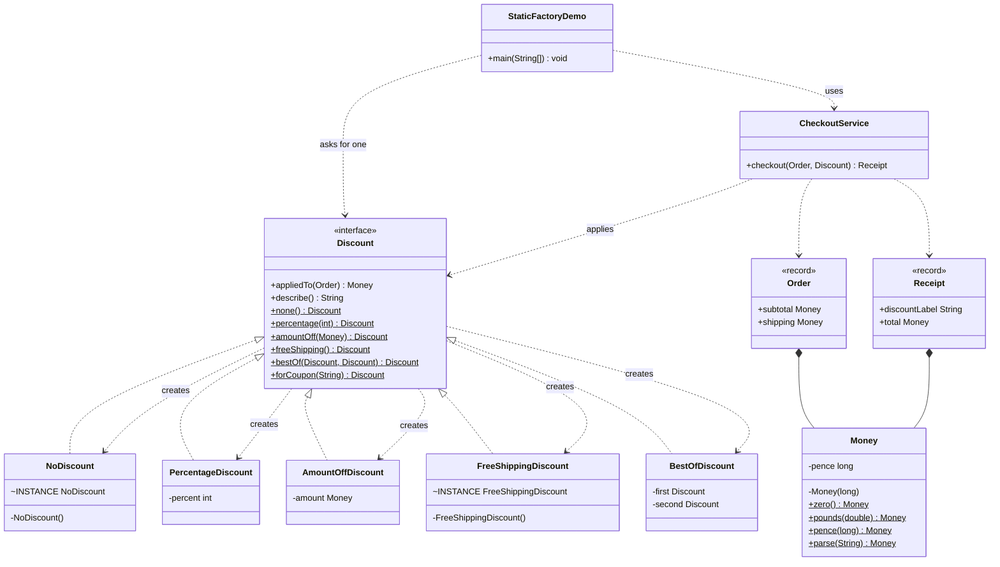
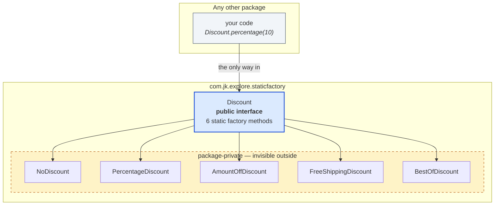

# Static Factory Method — Class Diagram

Two pictures. The first is the static structure: who implements what, and who
holds whom. The second is the one that actually explains the pattern — what a
caller outside the package is allowed to see.

## The structure

Mermaid source

Look at where the `creates` arrows start. They leave `Discount` — the
interface itself. In every other factory pattern the arrows leave a separate
factory object. Here the type is its own factory, and that is the whole idea.

## What the caller can see

Mermaid source

Five classes implement `Discount`, and not one of them is public. Your code
cannot name them, cannot `new` them, and never finds out how many there are.
That is not a rule anyone has to remember — the compiler enforces it.

The practical consequence: any of those five can be renamed, merged, split or
deleted tomorrow without touching a single caller.

## The public surface, in full

| You write | You get back | Notes |
| --- | --- | --- |
| `Discount.none()` | `NoDiscount` | Always the same instance |
| `Discount.percentage(10)` | `PercentageDiscount` | `percentage(0)` returns `none()` instead |
| `Discount.amountOff(Money.pounds(5))` | `AmountOffDiscount` | `amountOff(zero)` returns `none()` instead |
| `Discount.freeShipping()` | `FreeShippingDiscount` | Always the same instance |
| `Discount.bestOf(a, b)` | `BestOfDiscount` | Compares the two per order |
| `Discount.forCoupon("SAVE10")` | any of the above | The class depends on the string |

Six ways in, one type out. The right-hand column is information the caller
never has and never needs.

## Notes

- `Money` tells the same story in miniature. Its constructor is private and
  takes a `long`; `Money.pounds(2.50)` and `Money.pence(250)` are the same
  amount reached two ways, and neither could have been a constructor without
  the other one becoming impossible.
- `Order` and `Receipt` are plain records. Not everything needs a factory —
  they carry data, they have nothing to choose, so a constructor is right.
- Compare with [`../../simple-factory-pattern/docs/class-diagram.md`](../../simple-factory-pattern/docs/class-diagram.md).
  There, a separate `PaymentMethodFactory` class sits beside the product
  hierarchy. Here there is no separate class at all — delete the factory and
  you delete the type.
