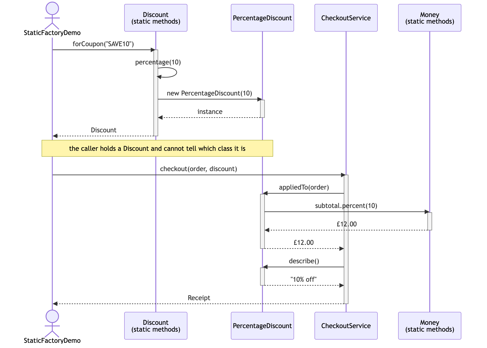
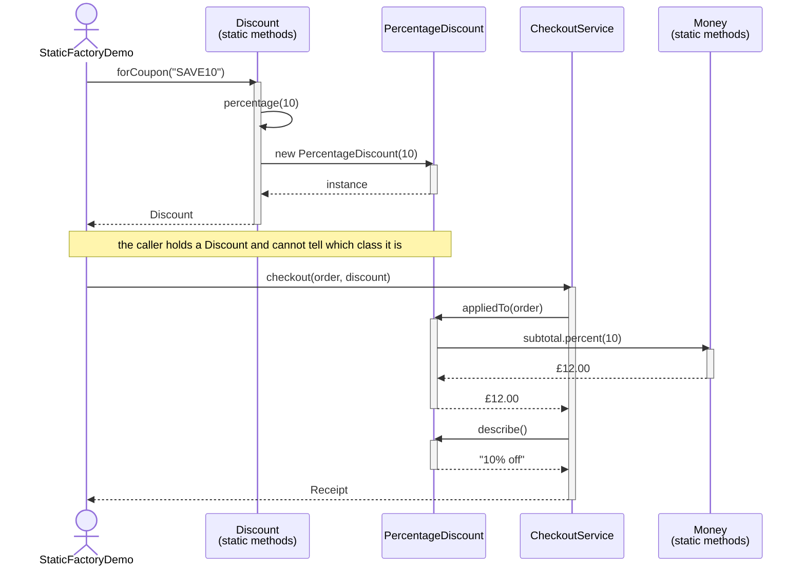

# Static Factory Method — UML Sequence Diagram

Shows the runtime flow: a coupon code goes into a static factory method, some
object comes out, and the checkout applies it without ever learning what it
got.

Mermaid source

## Notes

- Everything interesting happens above the note. Once `forCoupon` has
  returned, the decision is over — the rest of the diagram is the same
  regardless of which coupon was used.
- Swap `"SAVE10"` for `"FREESHIP"` in the first line and only the third
  participant changes, to `FreeShippingDiscount`. Every arrow below the note
  keeps its shape; only the answers differ — `£4.99` instead of `£12.00`,
  `"Free shipping"` instead of `"10% off"`.
- `forCoupon` calls `percentage`, which is a second static factory method.
  Factory methods calling other factory methods is normal and healthy: each
  one is a named entry point, and they are free to share the work.
- Run it with `"BESTDEAL"` and the object returned is a `BestOfDiscount`
  wrapping two others. The diagram would grow a nested `appliedTo` call — and
  the client's line of code would still be identical.
- Now imagine the first three arrows replaced by `new Discount(10)`. There is
  nowhere for the `percentage(0) → none()` substitution to live, nowhere to
  return a shared instance, and nothing to stop a caller from constructing a
  discount the domain does not allow. That absence is what the pattern buys.
- Compare with [`../../simple-factory-pattern/docs/uml-diagram.md`](../../simple-factory-pattern/docs/uml-diagram.md).
  The shape is nearly the same — but there the creation arrow points at a
  separate `PaymentMethodFactory` participant. Here it points back at the
  product's own type, so there is one fewer class in the world.
