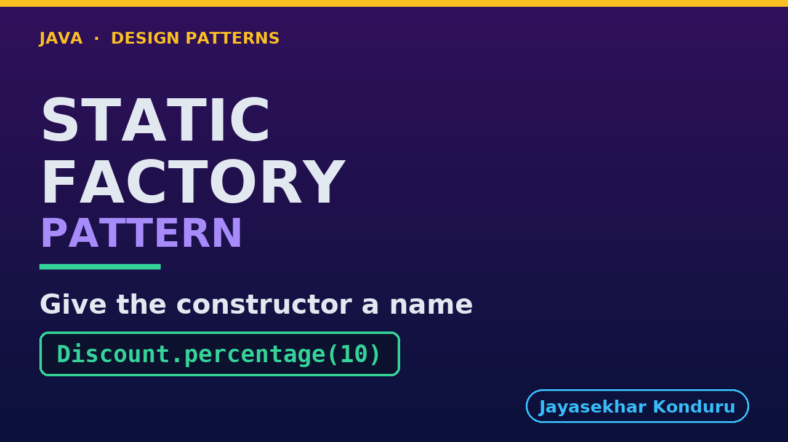

# YouTube — Static Factory Pattern

Everything needed to publish `video/static-factory-pattern-explained.mp4`. Copy the fields straight out of this file.

Chapter timings are generated from the video's `.srt`. Re-run `python3 docs/make_youtube_docs.py static-factory` after any change to the narration, or they will be wrong.

## Title

```
Static Factory Methods in Java - Named Constructors
```

51 characters — under the 60 YouTube shows before truncating in search results.

## Description

The first two lines are what a viewer sees above the fold, so they carry the hook rather than the boilerplate.

```
Learn the static factory method in Java 21 — Item 1 of Effective Java, and the creational technique you have already used every time you wrote List.of. We start from a constructor that will not compile, because ten percent off and ten pounds off are both a single number, and end with a discount type that names its own ways in, shares instances where it can, and hides every implementation class from its callers. We also cover, honestly, what it cannot do: a static method is resolved at compile time, so it cannot be overridden or configured — which is exactly why the other factory patterns exist. No prior design-pattern knowledge needed. Full source code and written notes are in the repository.

CHAPTERS
00:00 Introduction
00:55 The Job
01:22 The First Attempt Does Not Compile
02:08 So Everyone Writes This Instead
02:37 Why That Hurts
03:21 The Static Factory Method
04:00 A Vending Machine
04:35 The Shape of It
05:11 The Type Is Its Own Factory
05:52 Freedom Two: Not to Allocate
06:29 Freedom Three: to Choose the Class
07:09 What the Client Looks Like
07:37 The Same Trick on a Value Type
08:10 You Already Use This Every Day
09:04 Running It
09:45 Where It Stops
10:41 The Rest of the Family
11:21 One Sentence to Keep
11:52 Thanks for Watching

SOURCE CODE, WRITTEN NOTES AND AN INTERACTIVE ANIMATION
https://github.com/jk-boot-up/java-design-patterns/tree/main/gradle-java/creational/static-factory-pattern

WHAT YOU NEED FIRST
Java 21 and a working knowledge of classes and interfaces. No prior design-pattern knowledge is assumed. The full prerequisites are in docs/prerequisites.md in the repository.
```

## Chapters

YouTube renders these as chapters only if there are at least three and the first is at `00:00`.

```
00:00 Introduction
00:55 The Job
01:22 The First Attempt Does Not Compile
02:08 So Everyone Writes This Instead
02:37 Why That Hurts
03:21 The Static Factory Method
04:00 A Vending Machine
04:35 The Shape of It
05:11 The Type Is Its Own Factory
05:52 Freedom Two: Not to Allocate
06:29 Freedom Three: to Choose the Class
07:09 What the Client Looks Like
07:37 The Same Trick on a Value Type
08:10 You Already Use This Every Day
09:04 Running It
09:45 Where It Stops
10:41 The Rest of the Family
11:21 One Sentence to Keep
11:52 Thanks for Watching
```

## Tags

```
static factory method, named constructor java, effective java, design patterns, java design patterns, gang of four, java 21, software design, clean code, object oriented design, java tutorial, ecommerce, programming tutorial
```

224 characters, under YouTube's 500 limit.

## Thumbnail



**Upload `docs/thumbnail.png`** — 1280×720, the size YouTube recommends, generated by `docs/make_thumbnails.py`. It is deliberately not the same image as the video's opening frame: a thumbnail is judged at about 360 pixels wide in a search result, so this one carries only the pattern name, one line of promise and one short piece of code, each set large enough to survive the shrink.

`video/poster.png` is the 1920×1080 opening frame, produced by the video build. It stays in the repository as the title card; it is not what gets uploaded.

YouTube will not pick the thumbnail up on its own — upload it under **Details → Thumbnail → Upload file**. A custom thumbnail requires a verified channel.

## Upload checklist

- [ ] Upload `video/static-factory-pattern-explained.mp4` (1080p, H.264, 30 fps, AAC 48 kHz — already YouTube's recommended settings, no re-encode needed)
- [ ] Set the video language to **English** first, or the subtitle option may not appear
- [ ] Add subtitles: *Video elements → Add subtitles → Upload file → With timing* → `video/static-factory-pattern-explained.srt`
- [ ] Upload `docs/thumbnail.png` as the thumbnail — do not let YouTube auto-pick a frame
- [ ] Paste the title, description and tags from above
- [ ] Add to the **Java Design Patterns** playlist, in learning order
- [ ] Wait for 1080p processing before sharing the link — code slides are unreadable at 360p

## Cards and end screen

End screen links to **Factory Method Pattern**, the next video in the learning order.

Add a card partway through pointing at the playlist, so a viewer who arrives at this pattern from search can find the rest of the series.

## Runtime

Approximately 12:18, narrated at 145 words per minute.
