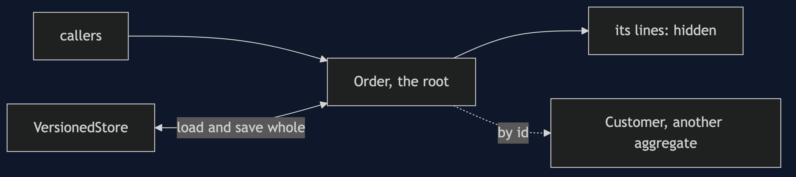
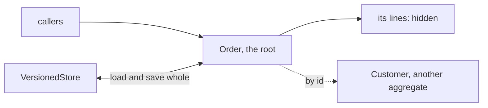

# Aggregate Pattern — Architecture Diagram

Callers reach the lines only through the root. The store saves the whole.

Mermaid source

```mermaid
flowchart LR
    C["callers"] --> R["Order, the root"]
    R --> L["its lines: hidden"]
    R -.->|by id| K["Customer, another aggregate"]
    S["VersionedStore"] <-->|load and save whole| R
```

