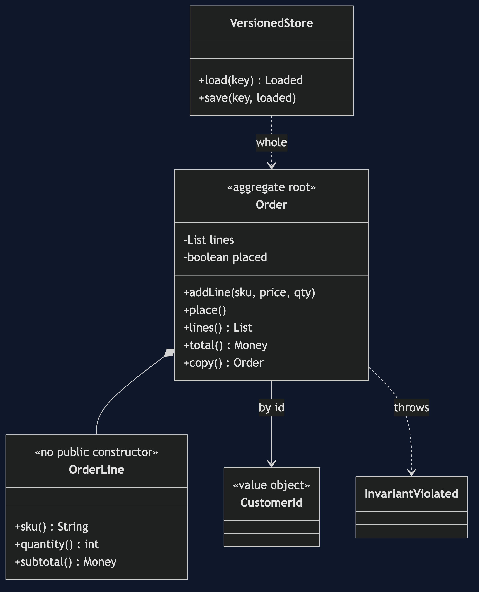
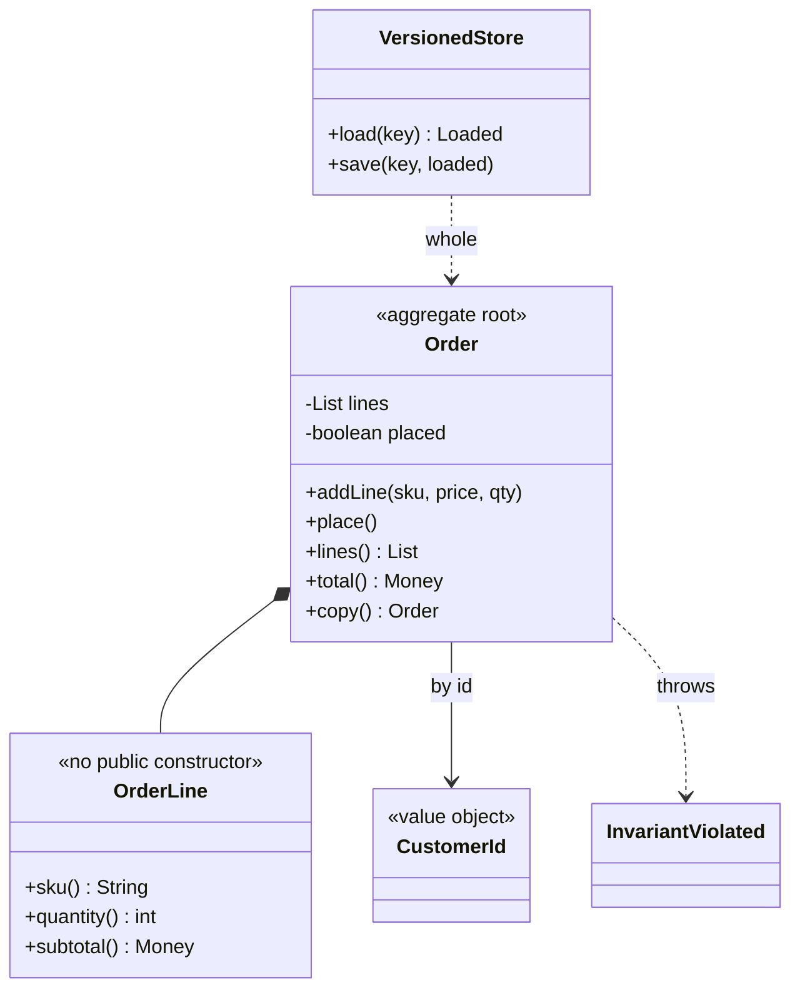

# Aggregate Pattern — Class Diagram

The root owns the lines and the rules. Other aggregates are held by id.

Mermaid source

```mermaid
classDiagram
    class Order {
        <<aggregate root>>
        -List lines
        -boolean placed
        +addLine(sku, price, qty)
        +place()
        +lines() List
        +total() Money
        +copy() Order
    }
    class OrderLine {
        <<no public constructor>>
        +sku() String
        +quantity() int
        +subtotal() Money
    }
    class CustomerId {
        <<value object>>
    }
    class VersionedStore {
        +load(key) Loaded
        +save(key, loaded)
    }
    class InvariantViolated
    Order *-- OrderLine
    Order --> CustomerId : by id
    Order ..> InvariantViolated : throws
    VersionedStore ..> Order : whole
```

