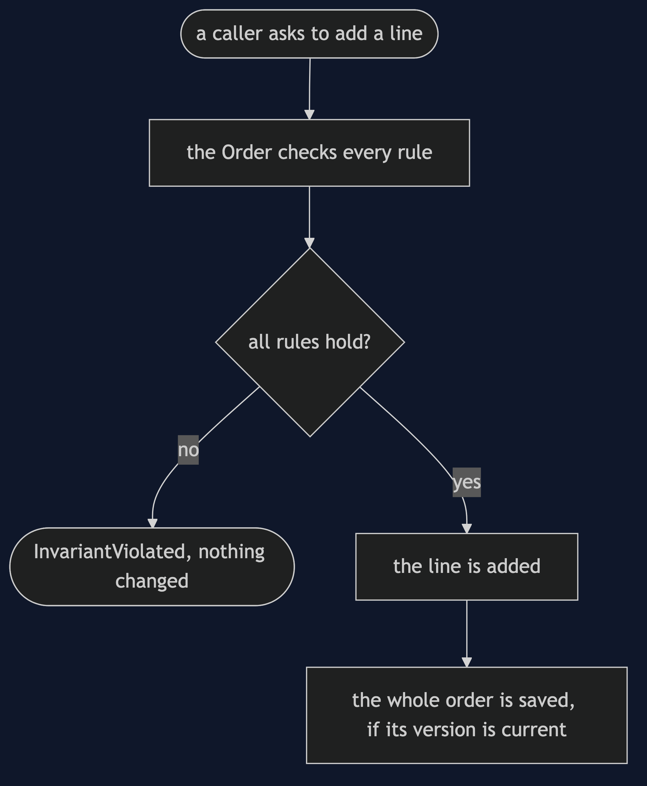
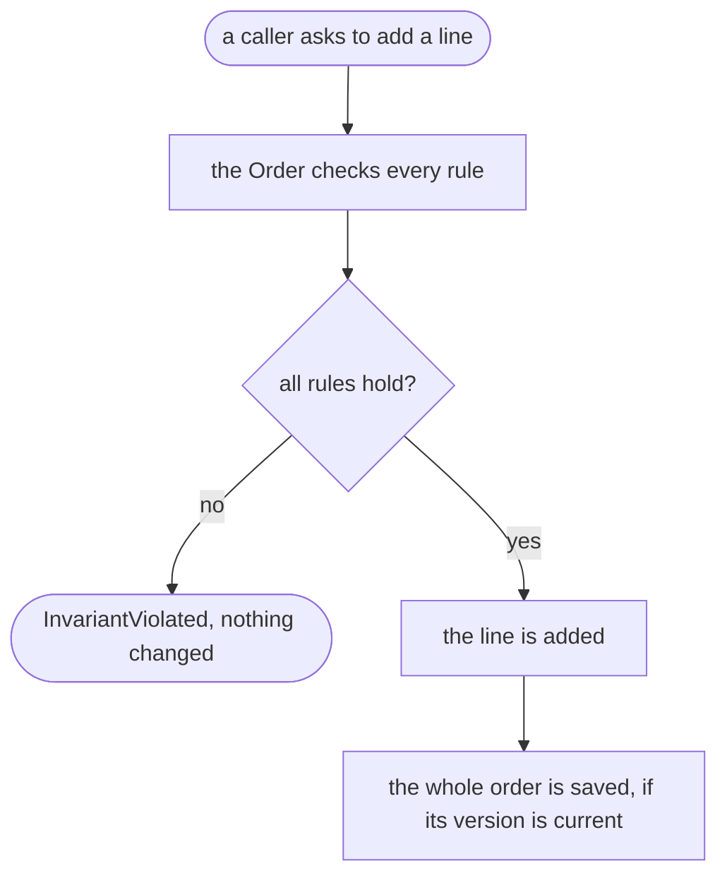

# Aggregate Pattern — Data Flow Diagram

What happens to a change.

Mermaid source

```mermaid
flowchart TD
    Ask(["a caller asks to add a line"])
    Root["the Order checks every rule"]
    Ok{"all rules hold?"}
    No(["InvariantViolated, nothing changed"])
    Yes["the line is added"]
    Save["the whole order is saved, if its version is current"]
    Ask --> Root --> Ok
    Ok -- no --> No
    Ok -- yes --> Yes --> Save
```

