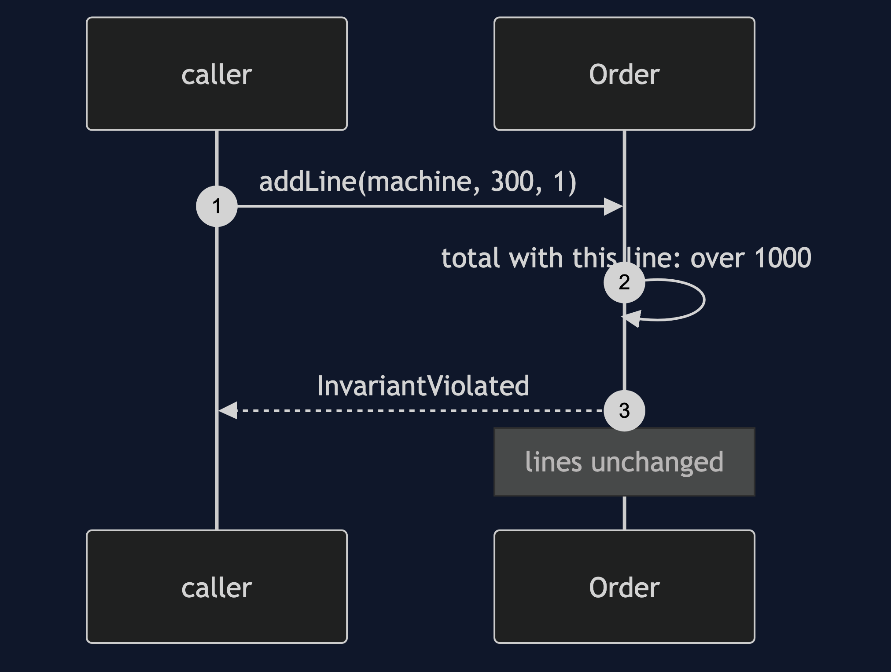
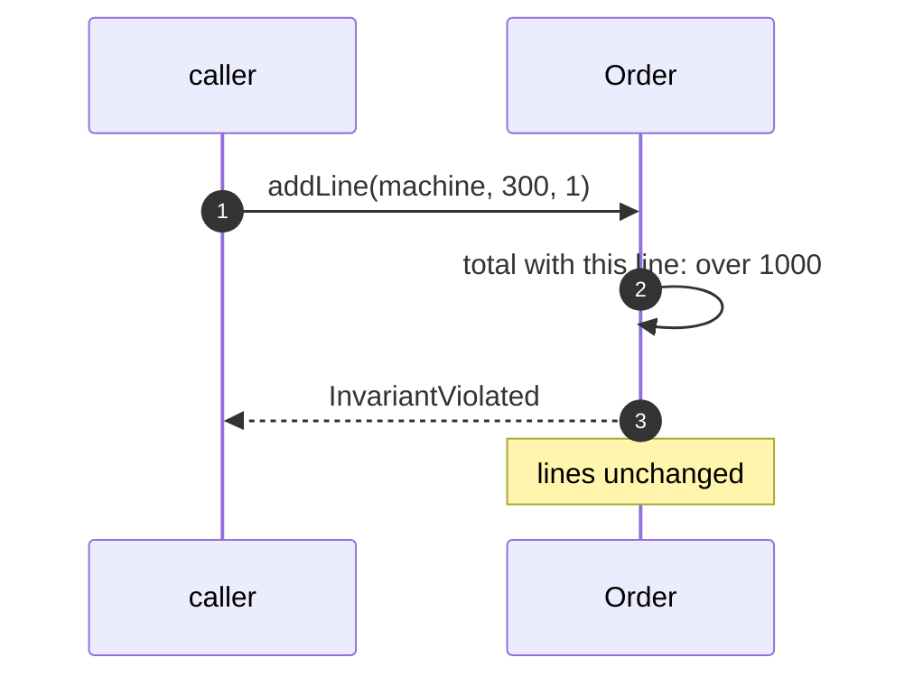

# Aggregate Pattern — Sequence Diagram

Written for a listener with the screen off.

Say it in words. A caller asks the order to add a line of one more machine. The order works out what the total would be with that line. It is over the limit, so the order throws an invariant violated exception, naming the rule, and the lines are exactly as they were. Nothing else in the system had to know the limit.

Mermaid source

The load-bearing sentence: **the rule lives in one place, and a refused change leaves the aggregate as it was.**
