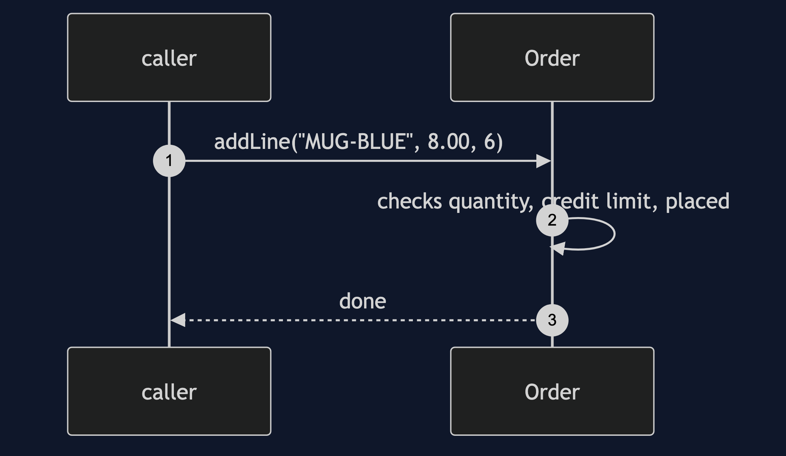
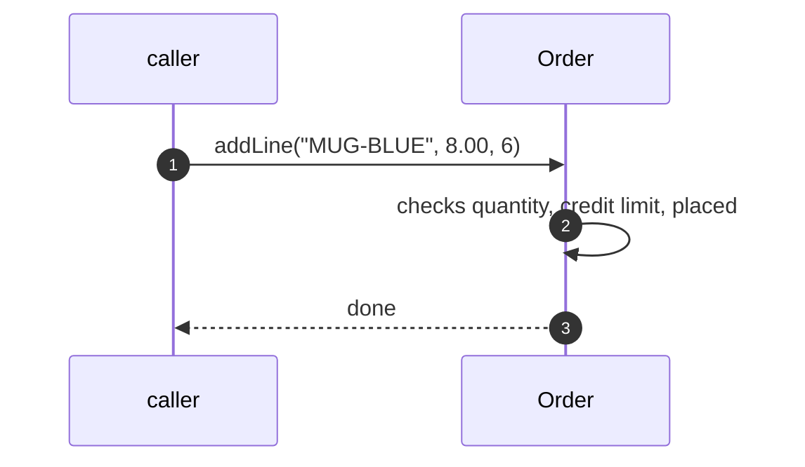
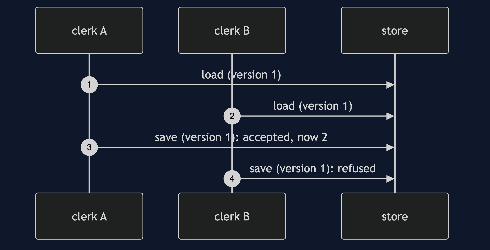
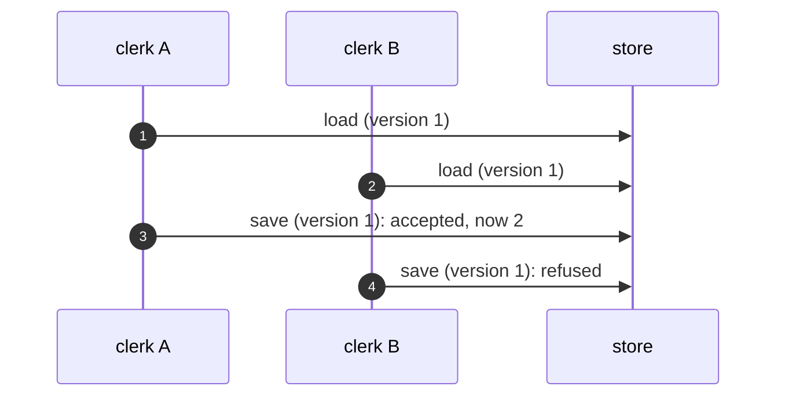
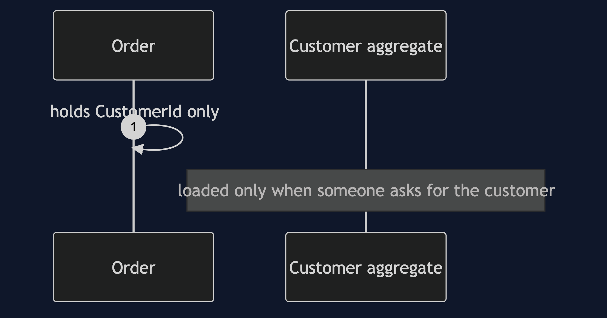
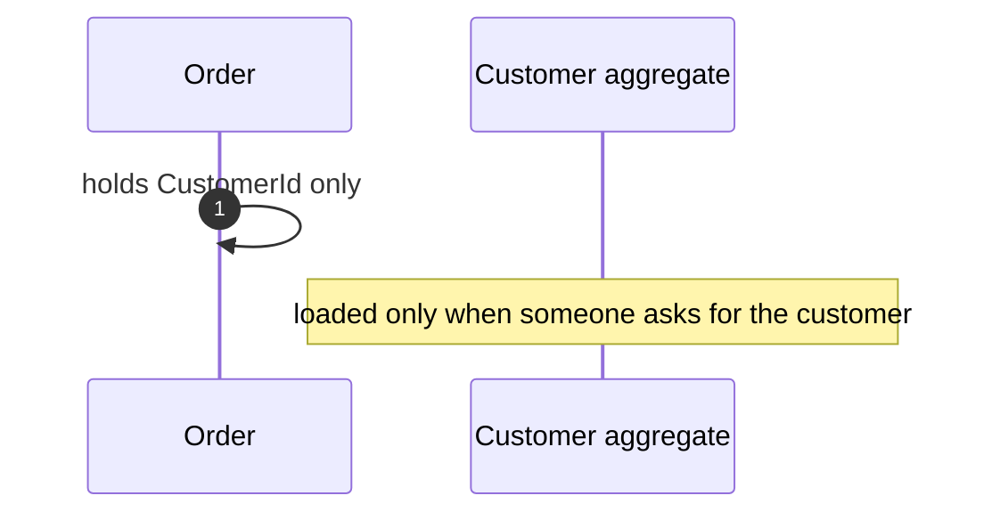
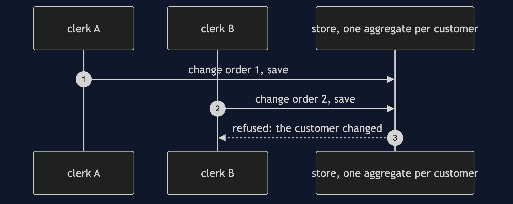
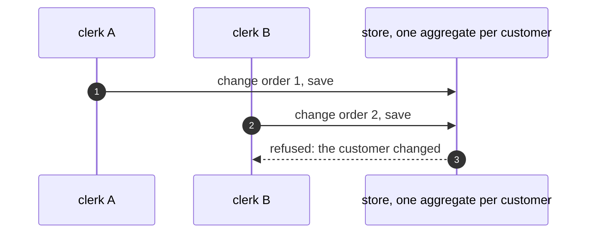

# Aggregate Pattern — UML Sequence Diagrams

Four sequences.

## 1. Adding A Line

Mermaid source

## 2. Two Clerks

Mermaid source

## 3. By Id

Mermaid source

## 4. Too Big

Mermaid source

