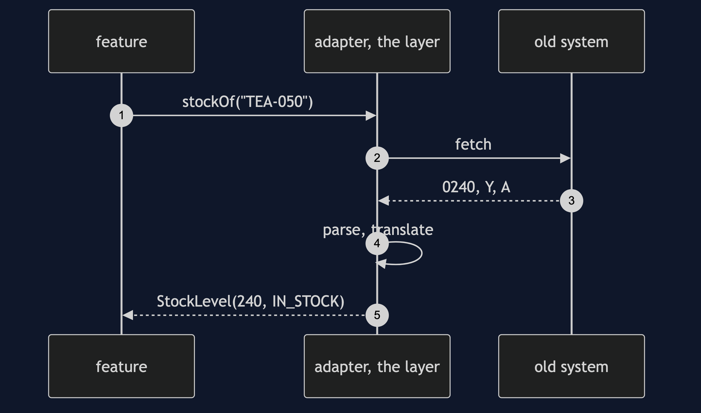

# Anti-Corruption Layer Pattern

```
src/main/java/com/jk/explore/acl/
├── AclDemo.java                     the six acts
│
├── domain/                          the shop's own model
│   ├── StockLevel.java  Availability.java
│   └── InventoryGateway.java         what the shop asks, in its own words
│
├── adapter/                         the layer
│   ├── LegacyInventoryAdapter.java   the only class that knows the old codes
│   └── UntranslatableLegacyData.java
│
├── legacy/                          the system we do not own
│   ├── LegacyStockRecord.java  LegacyInventorySystem.java
│
└── naive/
    └── NaiveShop.java                four features that learnt the codes themselves
```

**An anti-corruption layer translates someone else's model into yours, in one place, so it never seeps in.**

This project is in [domain-driven-design-patterns](..). It follows [Specification](../specification-pattern) and uses the same ideas as [Value Object](../value-object-pattern): the shop's own model is built from small, clean types, and the layer is what keeps them clean.

## Run

```bash
./gradlew run
```

Six acts. Every number quoted below comes from this program's own output.

```
ONE. Their model, everywhere.
  what the old system sends: LegacyStockRecord[ITM_CD=MUG-BLUE, QTY_ON_HND=0012, IN_STK_FLG=Y, ITM_STAT=A, LST_CNT_DT=20260114, WHSE_CD=W01, UOM=EA].
  product page: in stock. basket: true. reorder: 38. report: MUG-BLUE 12 A.
  places in the shop that have learnt the codes Y, N, A, D and S: 4.
TWO. Their model, translated once.
  StockLevel[sku=MUG-BLUE, available=12, availability=IN_STOCK], can be bought: true.
  StockLevel[sku=MUG-OLD, available=0, availability=DISCONTINUED], can be bought: false.
  StockLevel[sku=TEA-050, available=240, availability=IN_STOCK], can be bought: true.
  no code, and no string pretending to be a number, has crossed the layer.
THREE. Bad data stops at the door.
  the shortcut, deep in a report: NumberFormatException, and no sku in the message.
  the layer: legacy data for MUG-BLUE: quantity '12X' is not a number.
FOUR. The other side changes.
  the old system starts sending status H for a product on hold.
  the shortcut: page says in stock, basket allows it: true, reorder: 0. four places, four private guesses.
  the layer: ON_HOLD, can be bought: false. one decision, in one place.
FIVE. What the layer costs.
  the old row has 7 fields. the shop uses 4 of them. the layer drops: [LST_CNT_DT, WHSE_CD, UOM].
  the day a feature needs the last count date, the layer must be extended, and the shop's model with it.
SIX. What the layer protects.
  the shop's own words: [IN_STOCK, OUT_OF_STOCK, DISCONTINUED, ON_HOLD].
  the old system's words stay behind the layer. replace the old system, write one new adapter, and nothing else changes.
```

## Test

```bash
./gradlew test
```

2 test classes, 8 test methods, offline, with nothing installed and no framework.

## Technologies and versions

| What | Version | Why it is here |
| --- | --- | --- |
| Java | 21 | The repository standard, via the Gradle toolchain block |
| Gradle | 9.2.1 | The wrapper in this directory; no separate install needed |
| JUnit 5 | 5.10.2 | Test runner |

No framework. A hand-built project stays plain Java so the mechanism is the whole lesson.

## Learning Material

| Document | What it covers |
| --- | --- |
| [`docs/problem-statement.md`](docs/problem-statement.md) | An old system the shop cannot change |
| [`docs/anti-corruption-layer-pattern-explained.md`](docs/anti-corruption-layer-pattern-explained.md) | The pattern, and six acts |
| [`docs/class-diagram.md`](docs/class-diagram.md) | The types |
| [`docs/architecture-diagram.md`](docs/architecture-diagram.md) | The shop, the layer and the old system |
| [`docs/data-flow-diagram.md`](docs/data-flow-diagram.md) | How a record is translated |
| [`docs/sequence-diagram.md`](docs/sequence-diagram.md) | Written for a listener with the screen off |
| [`docs/uml-diagram.md`](docs/uml-diagram.md) | Four sequences |
| [`docs/animation.html`](docs/animation.html) | The six acts in a browser |
| [`docs/prerequisites.md`](docs/prerequisites.md) | What you need to know |
| [`docs/session.md`](docs/session.md) | A one-hour taught session |
| [`docs/spec.md`](docs/spec.md) | The generated specification |
| [`docs/youtube.md`](docs/youtube.md) | Title, description and chapters |

### The pattern in one picture


### Where each piece sits


### How one request moves


### Who calls whom, in order



### All four sequences


### Video

Built from [`video/scenes.py`](video/scenes.py) by
[`video/build_video.sh`](video/build_video.sh). The rendered file is not
committed; see the repository README for why.

## Where you have already met this

Any integration with a legacy system or a third-party API, when the team decides not to let its types into the domain.

## When this is too much

When the other system's model already matches yours, or when it is small and stable, a direct call is simpler. The layer earns its place against a model that is foreign, large or changing.

## Where this sits

This project is in [`domain-driven-design-patterns`](..), and is meant to be read with its neighbours there.
