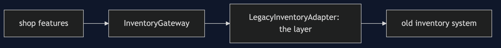
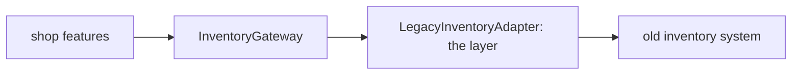

# Anti-Corruption Layer Pattern — Architecture Diagram

Everything in the shop speaks the shop's language. Only the layer speaks the old one.

Mermaid source

```mermaid
flowchart LR
    S["shop features"] --> G["InventoryGateway"]
    G --> A["LegacyInventoryAdapter: the layer"]
    A --> L["old inventory system"]
```

