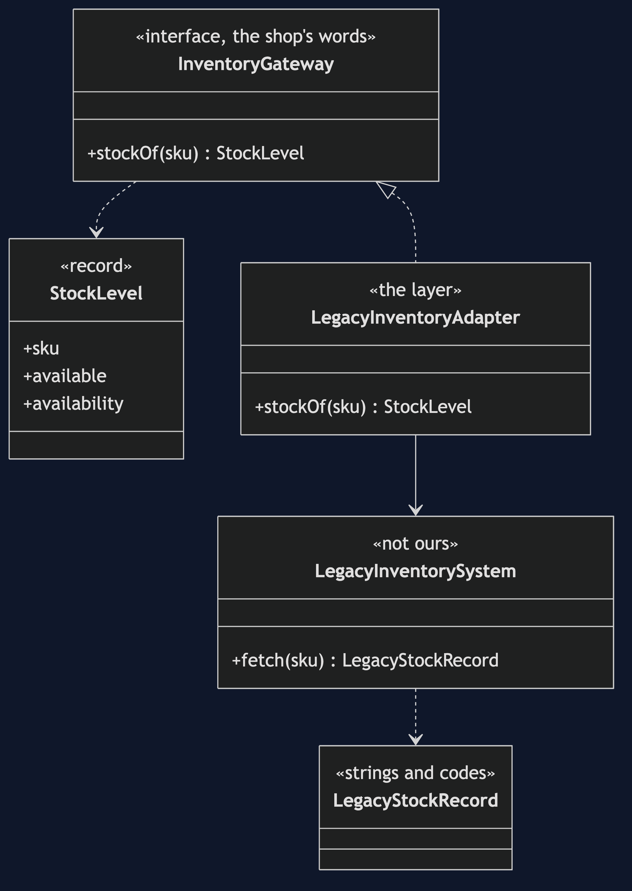
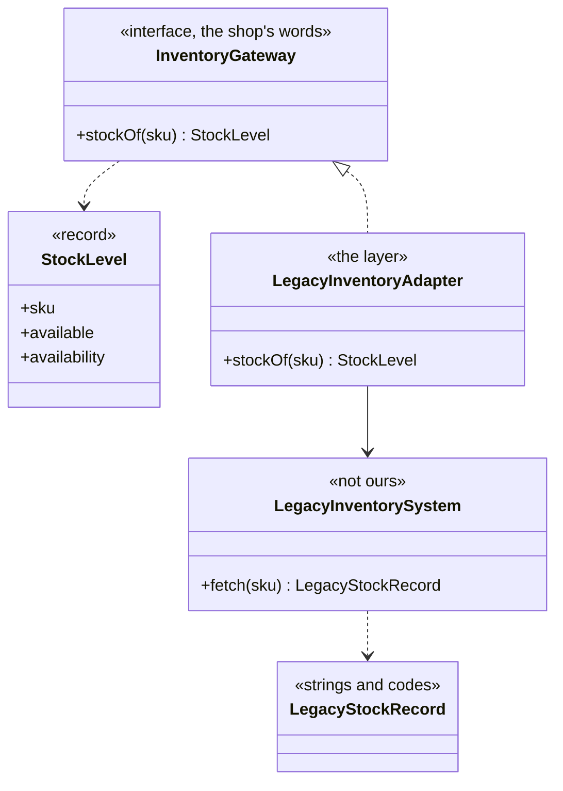

# Anti-Corruption Layer Pattern — Class Diagram

The shop asks a gateway in its own words. One adapter answers from the old system.

Mermaid source

```mermaid
classDiagram
    class InventoryGateway {
        <<interface, the shop's words>>
        +stockOf(sku) StockLevel
    }
    class StockLevel {
        <<record>>
        +sku
        +available
        +availability
    }
    class LegacyInventoryAdapter {
        <<the layer>>
        +stockOf(sku) StockLevel
    }
    class LegacyInventorySystem {
        <<not ours>>
        +fetch(sku) LegacyStockRecord
    }
    class LegacyStockRecord {
        <<strings and codes>>
    }
    InventoryGateway <|.. LegacyInventoryAdapter
    LegacyInventoryAdapter --> LegacyInventorySystem
    LegacyInventorySystem ..> LegacyStockRecord
    InventoryGateway ..> StockLevel
```

