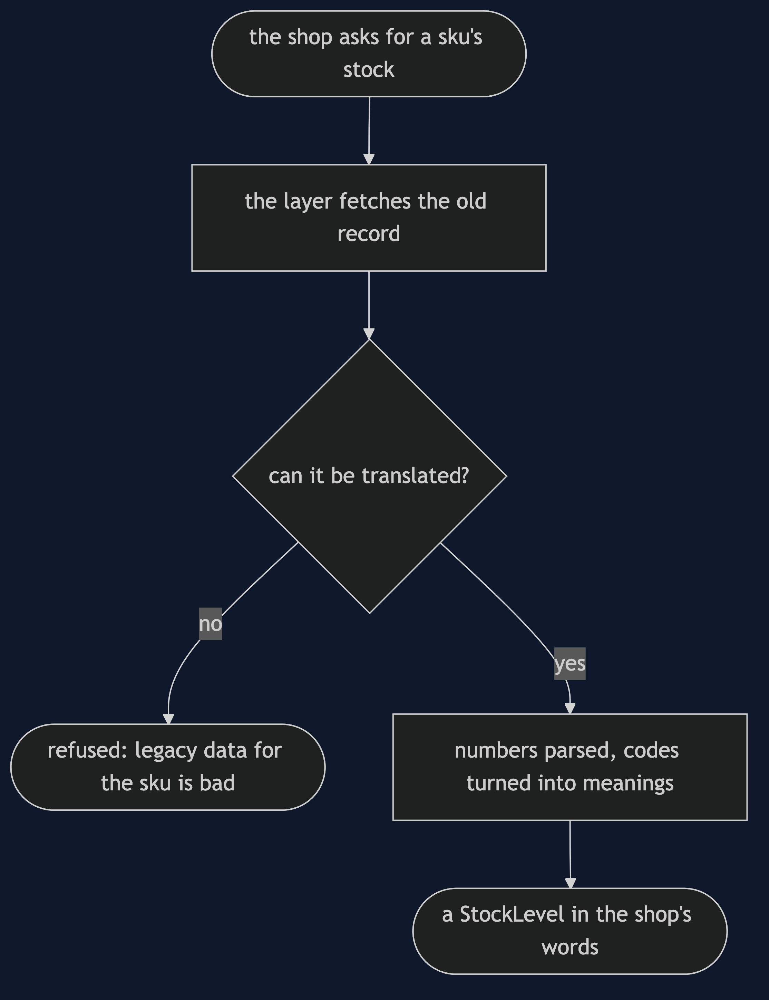
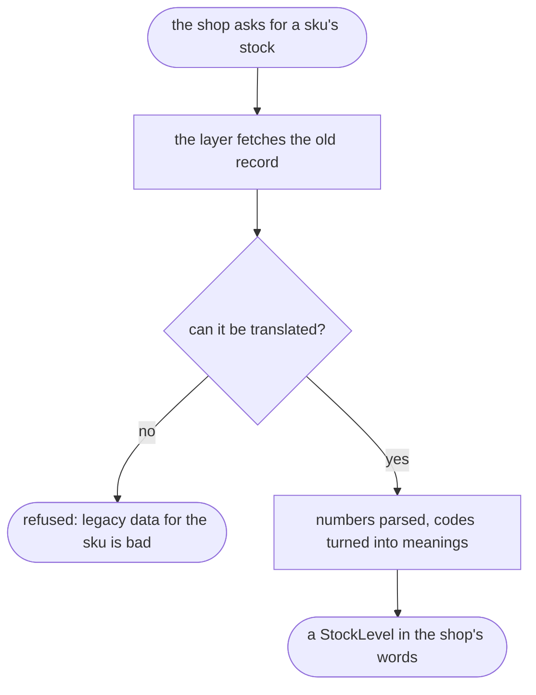

# Anti-Corruption Layer Pattern — Data Flow Diagram

How one record crosses the layer.

Mermaid source

```mermaid
flowchart TD
    Ask(["the shop asks for a sku's stock"])
    Fetch["the layer fetches the old record"]
    Ok{"can it be translated?"}
    Bad(["refused: legacy data for the sku is bad"])
    Map["numbers parsed, codes turned into meanings"]
    Out(["a StockLevel in the shop's words"])
    Ask --> Fetch --> Ok
    Ok -- no --> Bad
    Ok -- yes --> Map --> Out
```

