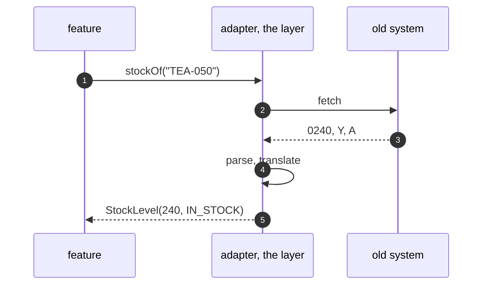

# Anti-Corruption Layer Pattern — Sequence Diagram

Written for a listener with the screen off.

Say it in words. A feature asks the gateway for the stock of the tea. The adapter fetches the old record, with a quantity of zero two four zero, a flag of Y and a status of A. It parses the quantity to two hundred and forty, and turns the flag and status into in stock. It returns a stock level in the shop's words. The feature never saw a string or a code.

Mermaid source

The load-bearing sentence: **the feature never sees a code.**
