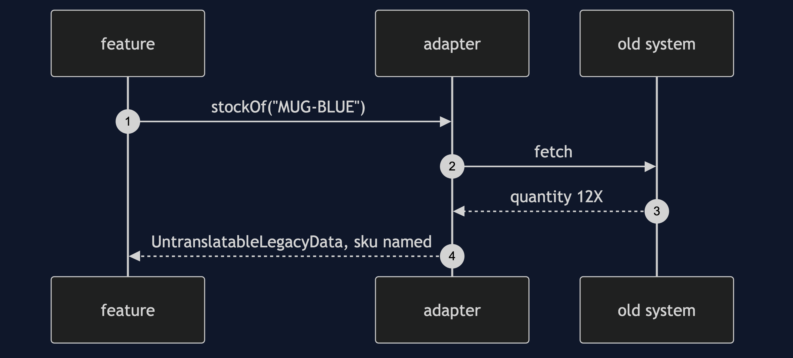
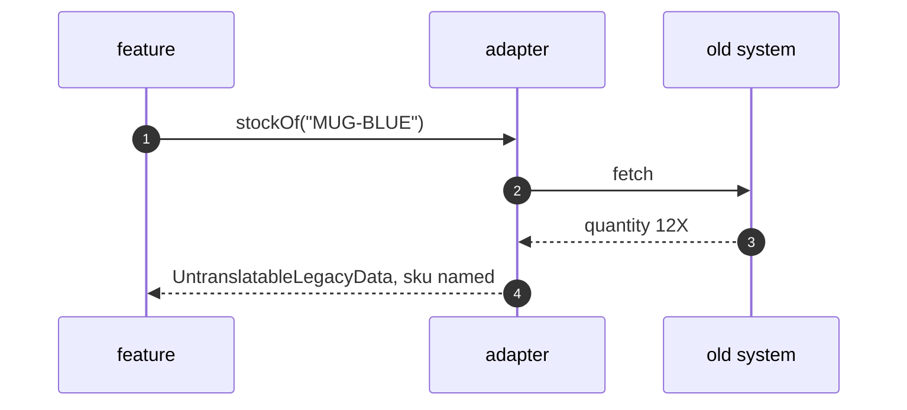
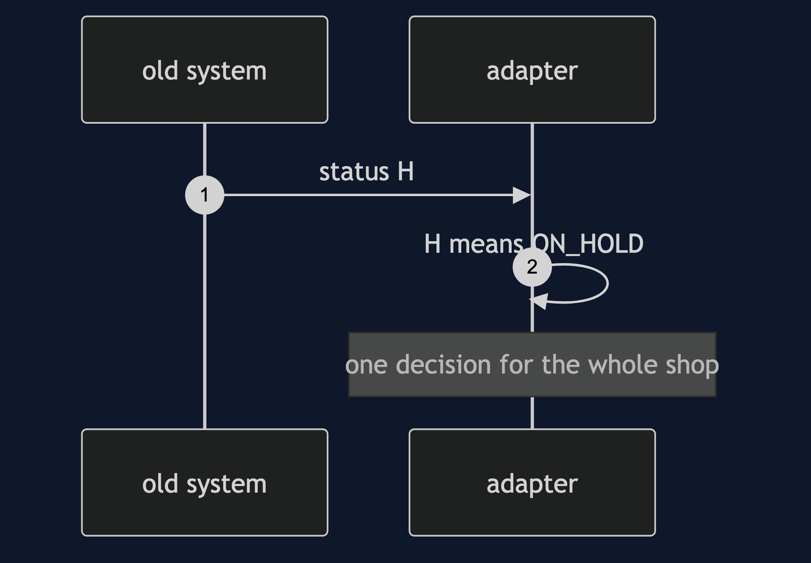
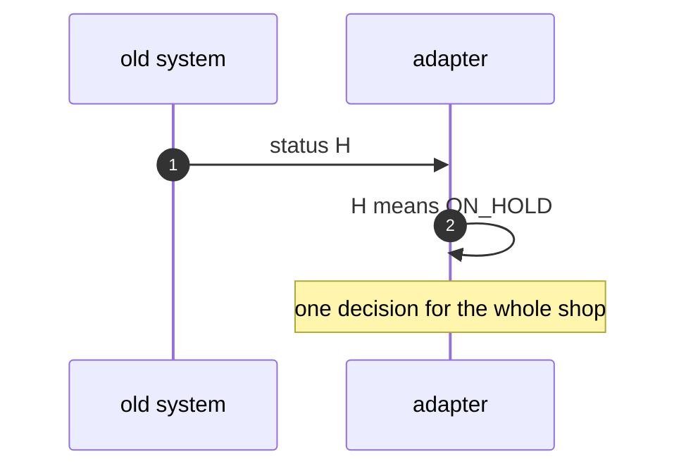

# Anti-Corruption Layer Pattern — UML Sequence Diagrams

Four sequences.

## 1. Bad Data

Mermaid source

```mermaid
sequenceDiagram
    autonumber
    participant F as feature
    participant A as adapter
    participant L as old system
    F->>A: stockOf("MUG-BLUE")
    A->>L: fetch
    L-->>A: quantity 12X
    A-->>F: UntranslatableLegacyData, sku named
```

## 2. A New Code

Mermaid source

```mermaid
sequenceDiagram
    autonumber
    participant L as old system
    participant A as adapter
    L->>A: status H
    A->>A: H means ON_HOLD
    Note over A: one decision for the whole shop
```

