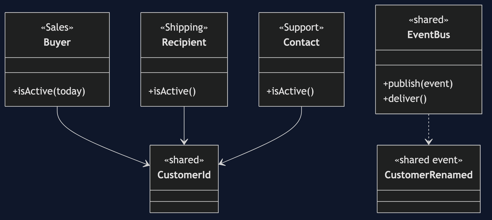
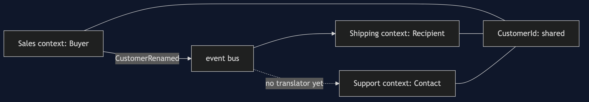
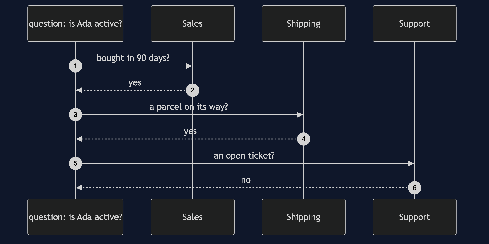

# Bounded Context Pattern

```
src/main/java/com/jk/explore/boundedcontext/
├── BoundedContextDemo.java          the six acts
│
├── sales/       Buyer.java  SalesContext.java          one context, one model
├── shipping/    Recipient.java  ShippingContext.java   another
├── support/     Contact.java                           a third
├── shared/      CustomerId.java  CustomerRenamed.java  EventBus.java   the only shared things
│
└── naive/
    └── GodCustomer.java              one Customer for the whole company
```

**A bounded context gives every word one meaning, by giving every department its own model.**

This is the last project so far in [domain-driven-design-patterns](..). It builds on [Aggregate](../aggregate-pattern), which is what lives inside a context, and [Domain Event](../domain-event-pattern) and [Anti-Corruption Layer](../anti-corruption-layer-pattern), which are how contexts talk.

## Run

```bash
./gradlew run
```

Six acts. Every number quoted below comes from this program's own output.

```
ONE. One Customer for everyone.
  fields in the company-wide Customer class: 12.
  each context uses a handful of them, and every one depends on the whole class, so one context's change is every context's change.
TWO. The same word, three meanings.
  is Ada an active customer?
    Sales, bought in the last 90 days:  true.
    Shipping, a parcel on its way:      true.
    Support, an open ticket:            false.
  one class cannot answer all three. each answer is right, in its own context.
THREE. A model for each context.
  Sales:    Buyer with 4 fields: credit limit, last purchase.
  Shipping: Recipient with 4 fields: address, parcels in transit.
  Support:  Contact with 4 fields: phone, open tickets.
  none of them knows the others' types. they share one thing, the CustomerId.
FOUR. The contexts talk by events.
  Sales renames Ada. Sales says: Ada King. Shipping says: Ada Lovelace. events waiting: 1.
  after the event is delivered, Shipping says: Ada King.
  Shipping translated a Sales fact into a change to its own Recipient. it never saw a Buyer.
FIVE. The boundary can be checked.
  imports of one context's types by another: 0.
  Shipping can add a field to Recipient and nothing in Sales or Support needs to change.
SIX. The bill.
  Ada's name is now stored three times: Sales, Shipping, Support.
  between the rename and the delivery, two contexts disagreed about her name. that gap is called eventual consistency.
  and every context needs its own translator for every event it cares about.
```

## Test

```bash
./gradlew test
```

2 test classes, 7 test methods, offline, with nothing installed and no framework.

## Technologies and versions

| What | Version | Why it is here |
| --- | --- | --- |
| Java | 21 | The repository standard, via the Gradle toolchain block |
| Gradle | 9.2.1 | The wrapper in this directory; no separate install needed |
| JUnit 5 | 5.10.2 | Test runner |

No framework. A hand-built project stays plain Java so the mechanism is the whole lesson.

## Learning Material

| Document | What it covers |
| --- | --- |
| [`docs/problem-statement.md`](docs/problem-statement.md) | One word, and three departments |
| [`docs/bounded-context-pattern-explained.md`](docs/bounded-context-pattern-explained.md) | The pattern, and six acts |
| [`docs/class-diagram.md`](docs/class-diagram.md) | The types |
| [`docs/architecture-diagram.md`](docs/architecture-diagram.md) | Three contexts and what they share |
| [`docs/data-flow-diagram.md`](docs/data-flow-diagram.md) | How a change crosses a boundary |
| [`docs/sequence-diagram.md`](docs/sequence-diagram.md) | Written for a listener with the screen off |
| [`docs/uml-diagram.md`](docs/uml-diagram.md) | Four sequences |
| [`docs/animation.html`](docs/animation.html) | The six acts in a browser |
| [`docs/prerequisites.md`](docs/prerequisites.md) | What you need to know |
| [`docs/session.md`](docs/session.md) | A one-hour taught session |
| [`docs/spec.md`](docs/spec.md) | The generated specification |
| [`docs/youtube.md`](docs/youtube.md) | Title, description and chapters |

### The pattern in one picture



### Where each piece sits



### How one request moves


### Who calls whom, in order


### All four sequences




### Video

Built from [`video/scenes.py`](video/scenes.py) by
[`video/build_video.sh`](video/build_video.sh). The rendered file is not
committed; see the repository README for why.

## Where you have already met this

Every large system split by department, and every microservice that owns its own data and its own vocabulary.

## When this is too much

In a small system that one team understands, one model is simpler, and translation is pure cost. A boundary earns its place where meanings really diverge.

## Where this sits

This project is in [`domain-driven-design-patterns`](..), and is meant to be read with its neighbours there.
