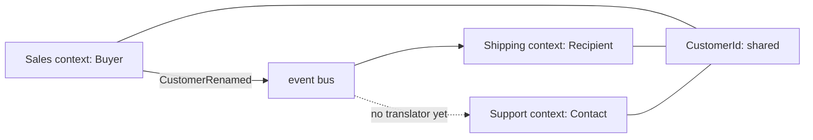

# Bounded Context Pattern — Architecture Diagram

Contexts do not import each other. They meet at the id and the event.

Mermaid source

```mermaid
flowchart LR
    S["Sales context: Buyer"] -->|CustomerRenamed| B["event bus"]
    B --> H["Shipping context: Recipient"]
    B -.->|no translator yet| U["Support context: Contact"]
    S --- I["CustomerId: shared"]
    H --- I
    U --- I
```

