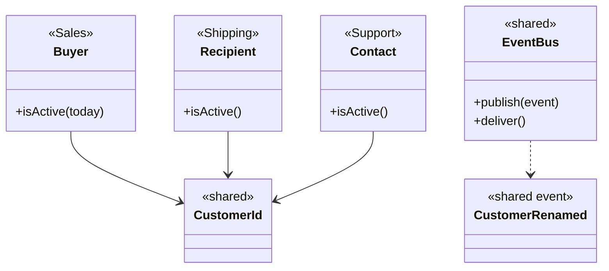

# Bounded Context Pattern — Class Diagram

Three contexts, each with its own model, sharing only an id and events.

Mermaid source

```mermaid
classDiagram
    class CustomerId {
        <<shared>>
    }
    class Buyer {
        <<Sales>>
        +isActive(today)
    }
    class Recipient {
        <<Shipping>>
        +isActive()
    }
    class Contact {
        <<Support>>
        +isActive()
    }
    class EventBus {
        <<shared>>
        +publish(event)
        +deliver()
    }
    class CustomerRenamed {
        <<shared event>>
    }
    Buyer --> CustomerId
    Recipient --> CustomerId
    Contact --> CustomerId
    EventBus ..> CustomerRenamed
```

