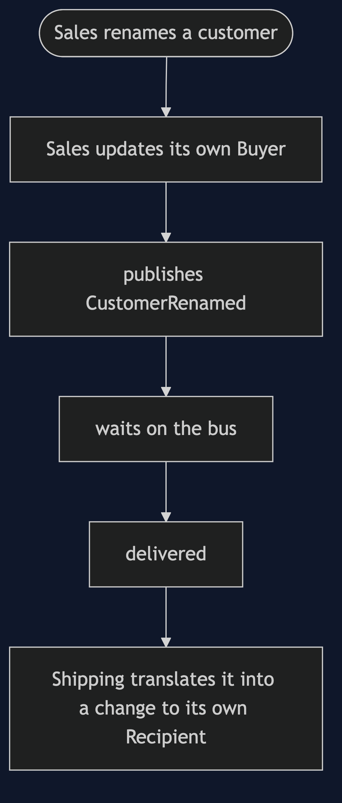
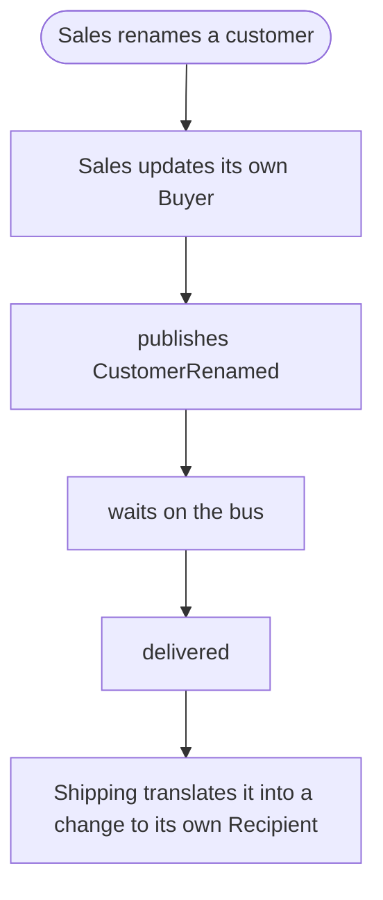

# Bounded Context Pattern — Data Flow Diagram

How a change in one context reaches another.

Mermaid source

```mermaid
flowchart TD
    Change(["Sales renames a customer"])
    Own["Sales updates its own Buyer"]
    Pub["publishes CustomerRenamed"]
    Wait["waits on the bus"]
    Del["delivered"]
    Tr["Shipping translates it into a change to its own Recipient"]
    Change --> Own --> Pub --> Wait --> Del --> Tr
```

