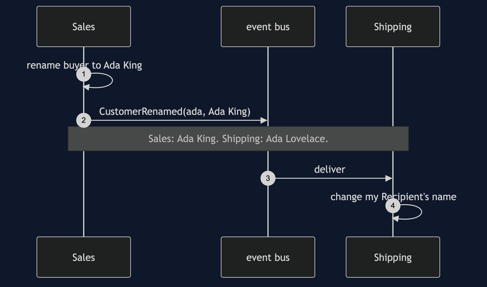
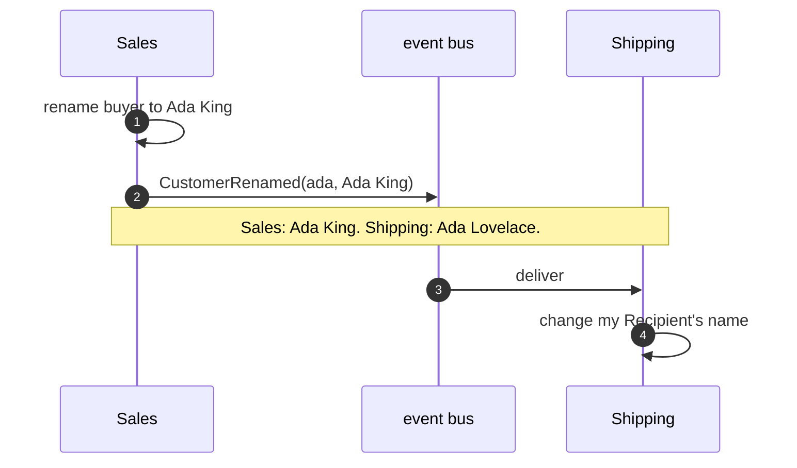

# Bounded Context Pattern — Sequence Diagram

Written for a listener with the screen off.

Say it in words. Sales renames Ada. Sales changes its own buyer and publishes a customer renamed event, with only the id and the new name. The event waits on the bus. At this moment Sales says Ada King and Shipping still says Ada Lovelace. When the bus delivers, Shipping's own handler finds its recipient by the id and changes the name. Shipping never saw a buyer.

Mermaid source

The load-bearing sentence: **contexts agree eventually, and each changes only its own model.**
