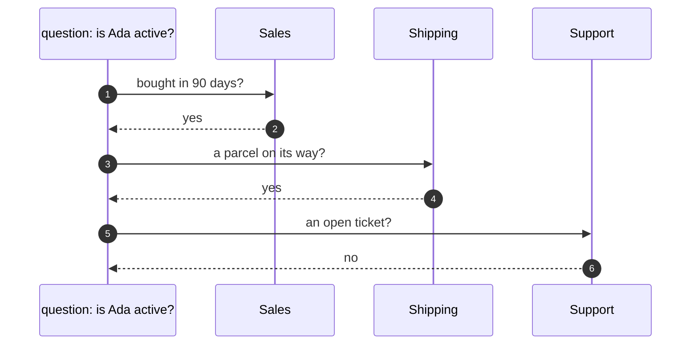

# Bounded Context Pattern — UML Sequence Diagrams

Four sequences.

## 1. Three Answers

Mermaid source

```mermaid
sequenceDiagram
    autonumber
    participant Q as question: is Ada active?
    participant S as Sales
    participant H as Shipping
    participant P as Support
    Q->>S: bought in 90 days?
    S-->>Q: yes
    Q->>H: a parcel on its way?
    H-->>Q: yes
    Q->>P: an open ticket?
    P-->>Q: no
```

