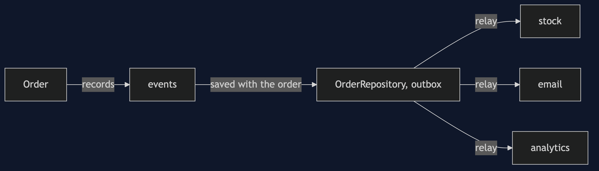
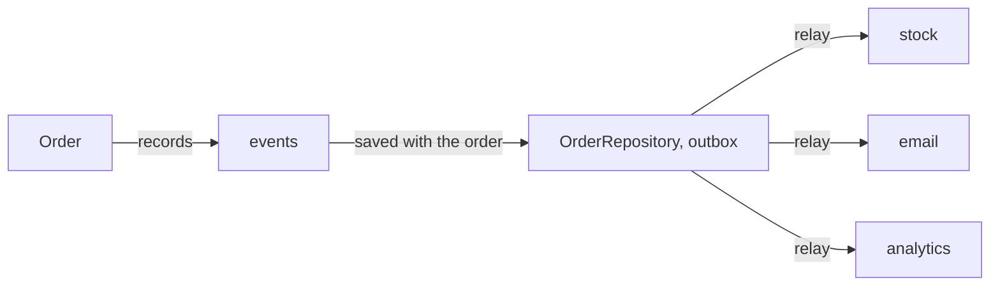

# Domain Event Pattern — Architecture Diagram

The order does not know the handlers. Events are kept, then delivered.

Mermaid source

```mermaid
flowchart LR
    O["Order"] -->|records| E["events"]
    E -->|saved with the order| R["OrderRepository, outbox"]
    R -->|relay| S["stock"]
    R -->|relay| M["email"]
    R -->|relay| A["analytics"]
```

