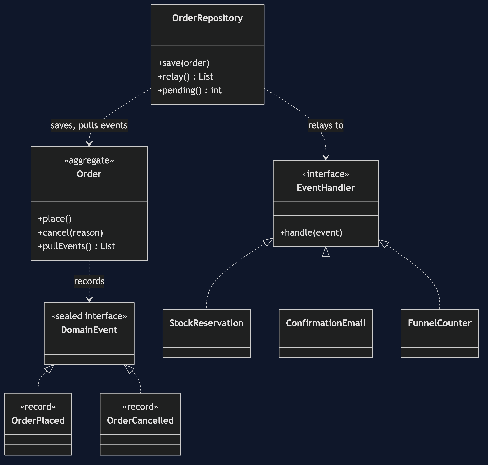
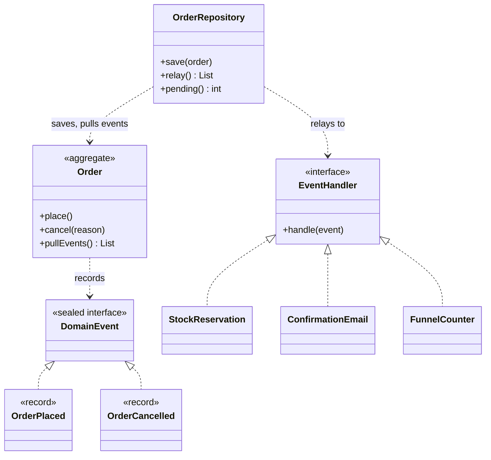

# Domain Event Pattern — Class Diagram

The order records events. The repository keeps them and a relay delivers them to handlers.

Mermaid source

```mermaid
classDiagram
    class Order {
        <<aggregate>>
        +place()
        +cancel(reason)
        +pullEvents() List
    }
    class DomainEvent {
        <<sealed interface>>
    }
    class OrderPlaced {
        <<record>>
    }
    class OrderCancelled {
        <<record>>
    }
    class OrderRepository {
        +save(order)
        +relay() List
        +pending() int
    }
    class EventHandler {
        <<interface>>
        +handle(event)
    }
    DomainEvent <|.. OrderPlaced
    DomainEvent <|.. OrderCancelled
    Order ..> DomainEvent : records
    OrderRepository ..> Order : saves, pulls events
    OrderRepository ..> EventHandler : relays to
    EventHandler <|.. StockReservation
    EventHandler <|.. ConfirmationEmail
    EventHandler <|.. FunnelCounter
```

