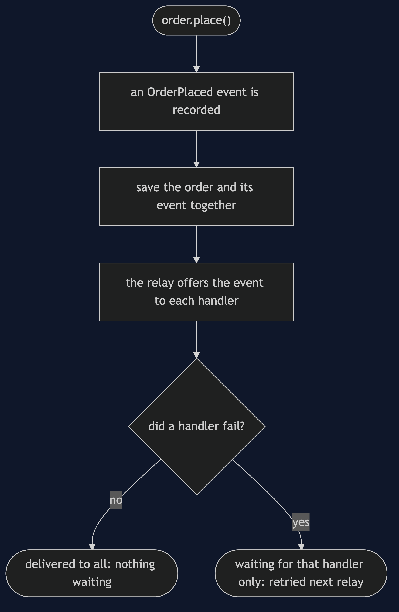
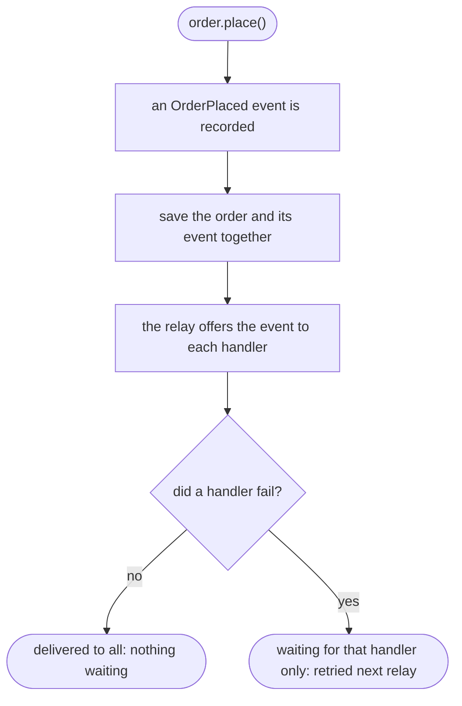

# Domain Event Pattern — Data Flow Diagram

From placing an order to the reactions.

Mermaid source

```mermaid
flowchart TD
    Place(["order.place()"])
    Rec["an OrderPlaced event is recorded"]
    Save["save the order and its event together"]
    Relay["the relay offers the event to each handler"]
    Ok{"did a handler fail?"}
    Done(["delivered to all: nothing waiting"])
    Wait(["waiting for that handler only: retried next relay"])
    Place --> Rec --> Save --> Relay --> Ok
    Ok -- no --> Done
    Ok -- yes --> Wait
```

