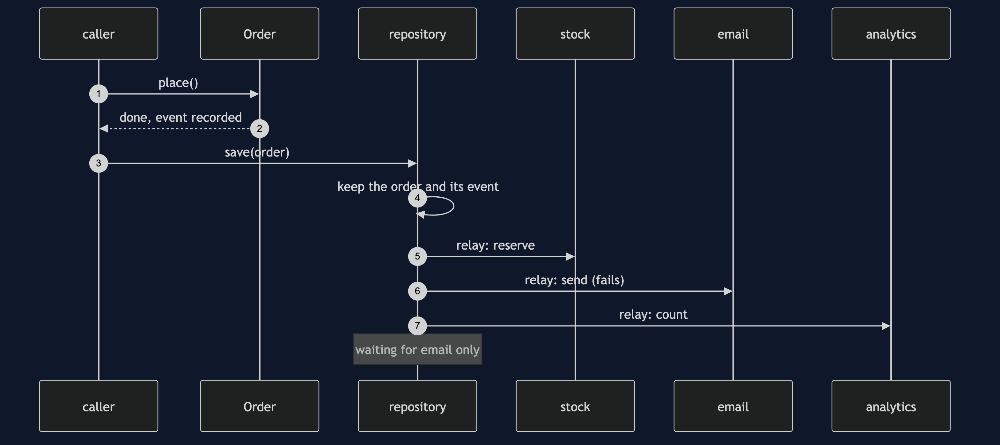
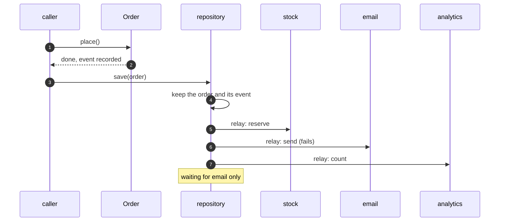

# Domain Event Pattern — Sequence Diagram

Written for a listener with the screen off.

Say it in words. The caller places the order, and the order records an order placed event and changes its status. The repository saves the order and keeps the event in the same step. Later the relay offers the event to stock, which reserves, to email, which fails because the mail server is down, and to analytics, which counts. The event stays waiting for email only. When the server is back, the next relay delivers it to email, and nothing is waiting.

Mermaid source

The load-bearing sentence: **the order is safe before anyone reacts.**
