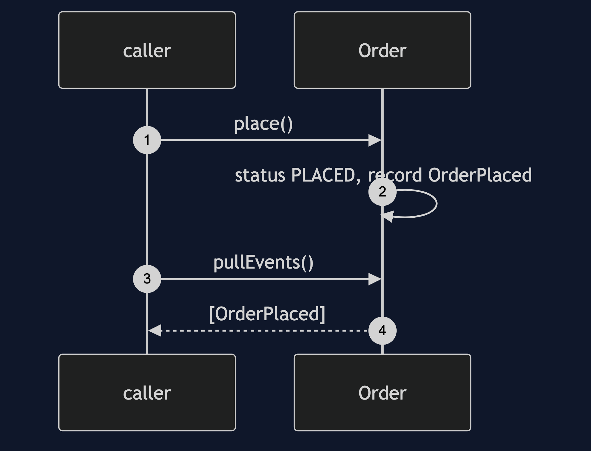
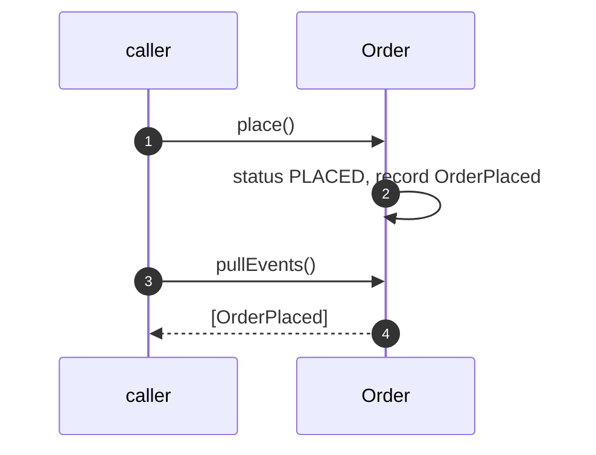
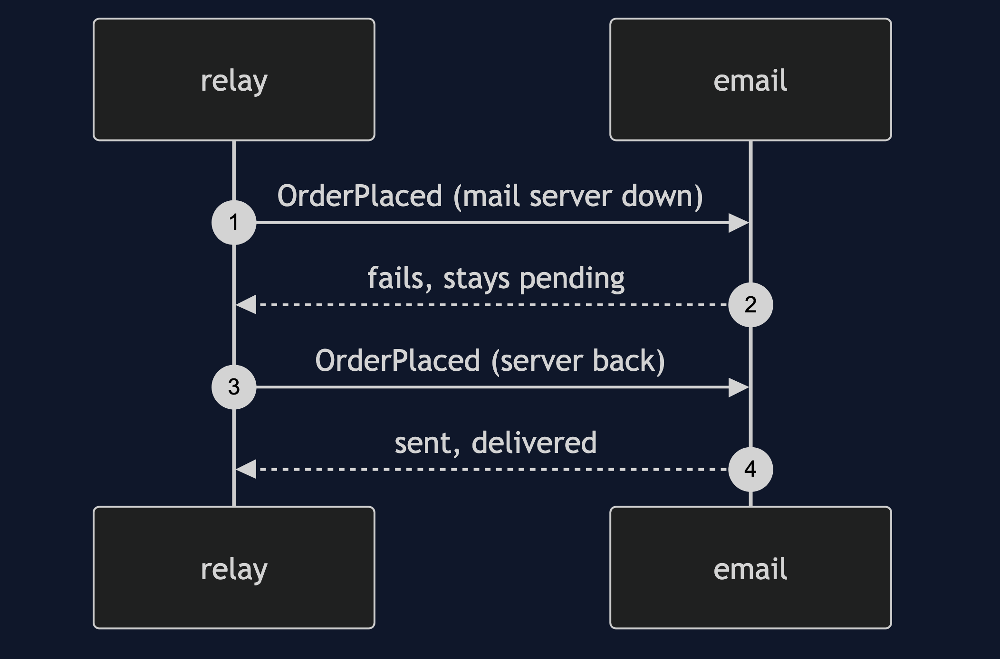
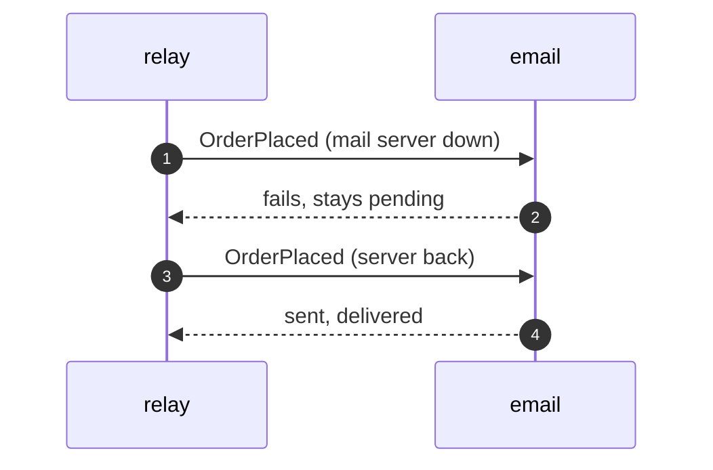
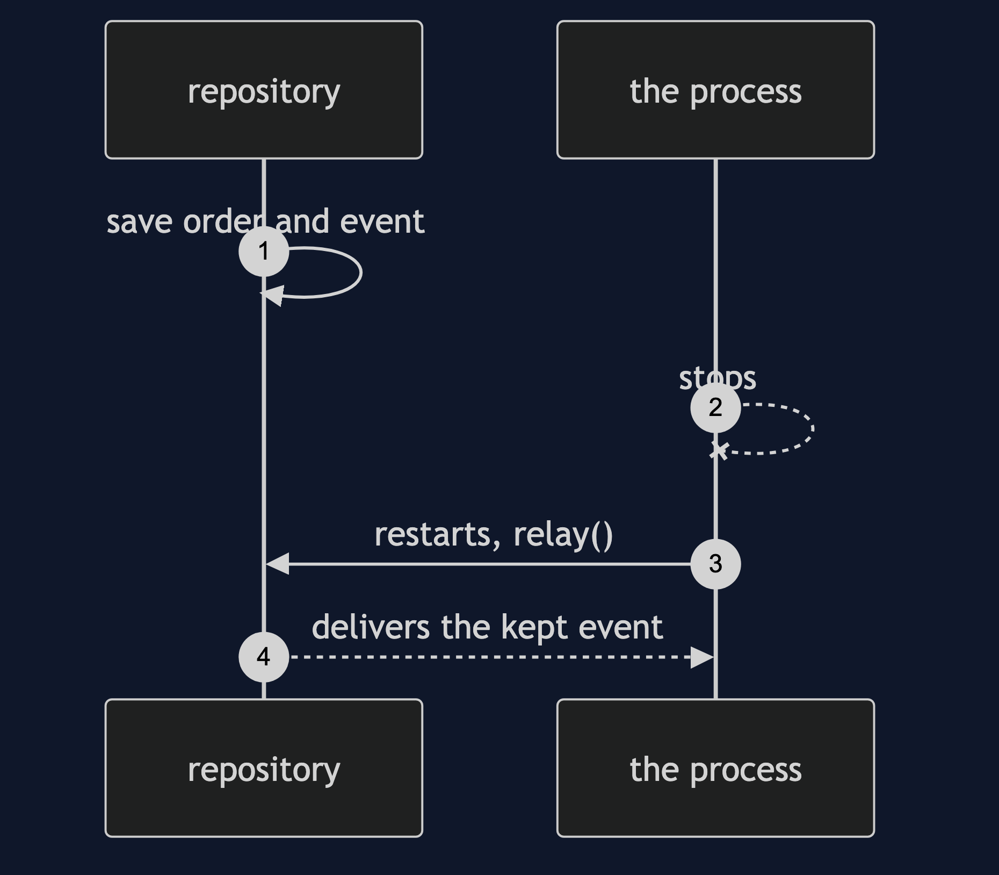
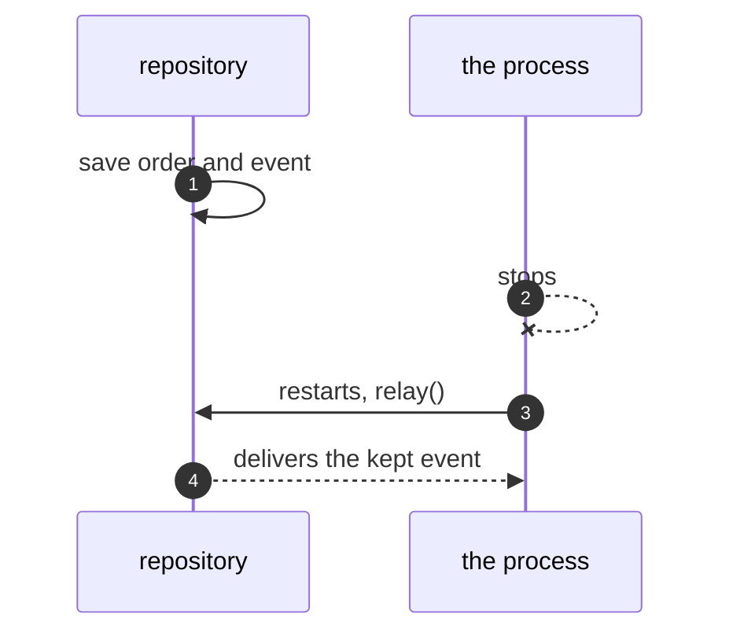

# Domain Event Pattern — UML Sequence Diagrams

Four sequences.

## 1. A Recorded Event

Mermaid source

## 2. A Retried Handler

Mermaid source

## 3. A Stop Between Save And Relay

Mermaid source

