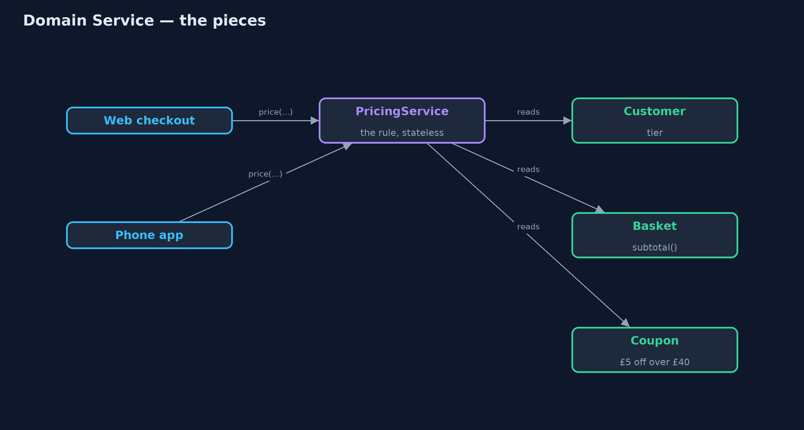
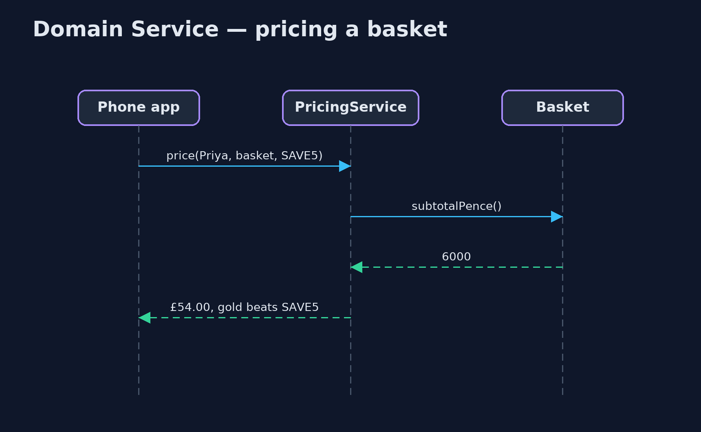

# Domain Service Pattern

```
src/main/java/com/jk/explore/domainservice/
├── Copies.java             Without the pattern: the pricing rule written inside each place that needs it
├── DomainServiceDemo.java  The five acts: the rule copied into two places, a domain service, the rule in the shop's words, many cases one service, and the bill
├── Model.java              The domain objects the pricing rule needs
└── PricingService.java     The pattern: a business rule that involves several domain objects and belongs to none of them, in its own stateless class
```

**When a business rule involves several domain objects and belongs to none of them, give it its own stateless class in the domain, named in the business's own words.**

Domain Service is one of the building blocks of domain-driven design. Most
business rules belong on an entity or a value object: a basket knows its own
subtotal. But some rules involve several objects at once and are not
naturally the job of any one of them, such as "a gold customer's discount and
a coupon do not add up; the bigger one wins", which needs the customer, the
basket and the coupon.

Such a rule gets its own class: a domain service. It holds no data of its own,
is named in the business's language, and lives in the domain, so every part
of the program that needs the rule uses the same one.

## The idea in everyday terms

Think of a referee at a football match. Whether a tackle was a foul involves
two players and the rules of the game. Neither player gets to decide, and the
decision is not part of either of them. The referee holds no score of their
own; they apply the rules, the same way, every time, whoever is playing.

## The scenario

The online store gives gold customers 10% off, and offers a coupon, SAVE5,
worth £5 off baskets over £40. The rule is that the two do not add up: the
bigger discount wins. The web checkout and the phone app each had their own
copy of that rule, and the app's copy was older and added both.

## Run

```bash
./gradlew run
```

The demo tells the story in 5 acts, each printing exact numbers that the tests check:

| Act | What it shows |
| --- | --- |
| 1. The rule, copied twice | Gold customer, £60 basket, SAVE5: the web says £54.00, the phone app's older copy says £49.00. |
| 2. A domain service | PricingService holds the rule once; web and app both call it and both say £54.00. |
| 3. In the shop's words | The service explains itself: subtotal £60.00; gold 10% -£6.00 beats SAVE5 -£5.00. |
| 4. One service, every case | One stateless service prices five cases: £60.00, £55.00, £54.00, £54.00, and £30.00 for a basket under the coupon minimum. |
| 5. The bill | The basket keeps its own subtotal; moving that into a service too would leave a bag of data. |

## Test

```bash
./gradlew test
```

5 tests in `DemoRunsTest`, `PricingServiceTest`. Every number the demo prints is asserted, and nothing depends on the clock, so every run gives the same result.

## Technologies and versions

| Technology | Version | Used for |
| --- | --- | --- |
| Java | 21 | the code (toolchain set in `build.gradle`) |
| Gradle | 9.2.1 (wrapper) | build and run, nothing to install |
| JUnit | 5.10.2 | the tests |
| videokit | repository tool | the narrated video and animation: Piper `en_US-amy-medium`, speed 0.8, longer pauses (the approved `amy-slow` voice) |

## Learning Material

| Document | What it is for |
| --- | --- |
| [Problem statement](docs/problem-statement.md) | the situation and what the project must show |
| [Prerequisites](docs/prerequisites.md) | what you need to know first |
| [Domain Service, explained](docs/domain-service-pattern-explained.md) | the acts in prose |
| [Session guide](docs/session.md) | a one-hour lesson with exercises |
| [Animated walkthrough](docs/animation.html) | the acts step by step, narrated |
| [Spec](docs/spec.md) | what this project must be true of |

### The pattern in one picture

Both front ends call one rule, which reads three domain objects.



### Where each piece sits

The service has no fields; the domain objects keep their own facts.


### How the data moves

Two discounts computed, the bigger one applied.


### Who calls whom, in order

The service asks each object for its own facts.



### Video

`video/domain-service-pattern-explained.mp4` (with `.m4a` audio and `.srt` subtitles) is built by `video/build_video.sh`. Rendered media is not committed.

## What it costs

- **Services can empty the objects.** Moving every rule into services leaves entities as bags of data with no behaviour.
- **One more place to look.** A developer must know the service exists to find the rule.
- **The name matters.** A vague `PricingManager` or `OrderHelper` soon collects unrelated code.

## When this is too much

When a rule belongs to one object, keep it there: the basket's subtotal
belongs to the basket. Domain services are for rules that genuinely span
several objects. And they are not application services: a domain service
holds business rules, not steps like "load, call, save, send email".

## Where you have already met this

- Pricing, tax and shipping calculators that take several objects.
- Transfer services that move money or stock between two entities.
- Classes named after a business activity: `PricingService`, `RefundPolicy`.

## Where this sits

This project is in [domain-driven-design-patterns](..), next to
[Entity](../entity-pattern) and [Value Object](../value-object-pattern),
which hold the rules that do belong to one object.
