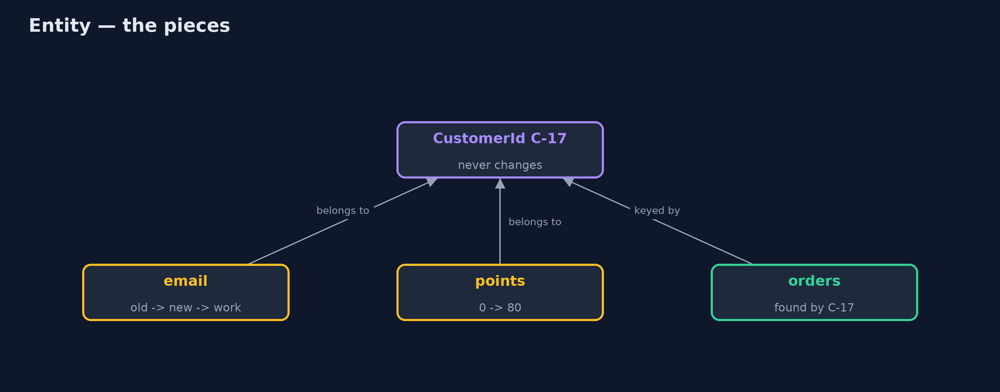
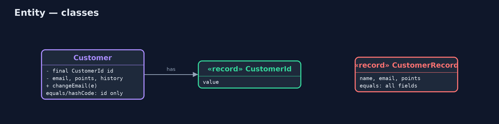
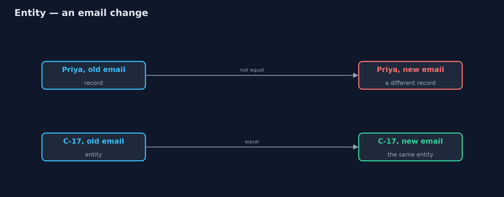

# Entity Pattern

```
src/main/java/com/jk/explore/entity/
├── Customer.java        The pattern: a customer is defined by its identity, not by its current details
├── CustomerId.java      A customer's identity: given once, when the account is opened, and never changed
├── CustomerRecord.java  Without the pattern: a customer defined by its values
└── EntityDemo.java      The five acts: a customer defined by values, a customer with an identity, two people who look alike, a life story, and the bill
```

**Some things are defined by who they are, not by their current details: give them an identity that never changes, and compare them by that identity alone.**

Entity is one of the building blocks of domain-driven design. An entity is
something the business cares about as an individual, followed through time: a
customer, an order, a parcel. Its details change (a new email, more points,
a new address), but it stays the same thing. So it is given an identity, such
as a customer ID, that is assigned once and never changes, and two entity
objects are equal when their identities are equal, whatever their details say.

Its opposite is a value object, such as an amount of money or an address,
which has no identity and is equal to any other with the same values.

## The idea in everyday terms

Think of a car. Over the years it is resprayed, gets new tyres, new number
plates, and a new owner. It is still the same car, because its chassis number,
stamped into the frame at the factory, never changes. Two cars of the same
model and colour, side by side, are still two different cars.

## The scenario

The online store kept customers as records compared by all their fields. When
Priya changed her email, the shop treated her as a new customer: her orders
could not be found by the new record, and the mailing list held two of her.
And a father and son sharing a name and a family email were treated as one
person.

## Run

```bash
./gradlew run
```

The demo tells the story in 5 acts, each printing exact numbers that the tests check:

| Act | What it shows |
| --- | --- |
| 1. Defined by values | Priya's old and new records are not equal; her orders are not found; the mailing list holds 2 of her. |
| 2. Defined by identity | Customer C-17 changes email and stays C-17: her orders are found and the mailing list holds 1. |
| 3. Look-alikes are different | Father and son with the same name and email are equal as records, different as entities C-42 and C-43. |
| 4. A life story | Priya's history shows three emails; she has 80 points; her ID never changed. |
| 5. The bill | A cached copy and the live customer are equal, yet their emails differ; IDs must be unique and never reused. |

## Test

```bash
./gradlew test
```

8 tests in `CustomerTest`, `DemoRunsTest`. Every number the demo prints is asserted, and nothing depends on the clock, so every run gives the same result.

## Technologies and versions

| Technology | Version | Used for |
| --- | --- | --- |
| Java | 21 | the code (toolchain set in `build.gradle`) |
| Gradle | 9.2.1 (wrapper) | build and run, nothing to install |
| JUnit | 5.10.2 | the tests |
| videokit | repository tool | the narrated video and animation: Piper `en_US-amy-medium`, speed 0.8, longer pauses (the approved `amy-slow` voice) |

## Learning Material

| Document | What it is for |
| --- | --- |
| [Problem statement](docs/problem-statement.md) | the situation and what the project must show |
| [Prerequisites](docs/prerequisites.md) | what you need to know first |
| [Entity, explained](docs/entity-pattern-explained.md) | the acts in prose |
| [Session guide](docs/session.md) | a one-hour lesson with exercises |
| [Animated walkthrough](docs/animation.html) | the acts step by step, narrated |
| [Spec](docs/spec.md) | what this project must be true of |

### The pattern in one picture

Details change around a fixed identity.



### Where each piece sits

The identity is a small value; the entity compares by it.



### How the data moves

By value, a new customer; by identity, the same one.



### Who calls whom, in order

The map uses the ID, so the change does not matter.


### Video

`video/entity-pattern-explained.mp4` (with `.m4a` audio and `.srt` subtitles) is built by `video/build_video.sh`. Rendered media is not committed.

## What it costs

- **Equal is not up to date.** A cached copy and the live customer are equal, because they share an ID, even when their details differ.
- **IDs must be managed.** Every entity needs an ID that is unique, assigned once and never reused.
- **Not for everything.** Treating values (amounts, addresses) as entities adds IDs nobody needs.

## When this is too much

When the business does not care which one it is, only what it is (£10 is
£10, whichever coin), use a value object instead. Entities are for things
followed individually through time.

## Where you have already met this

- JPA `@Entity` classes with an `@Id` field.
- Database primary keys.
- `equals` and `hashCode` written over an ID field only.

## Where this sits

This project is in [domain-driven-design-patterns](..), next to its opposite,
[Value Object](../value-object-pattern), and to
[Aggregate](../aggregate-pattern), which groups entities under one root.
