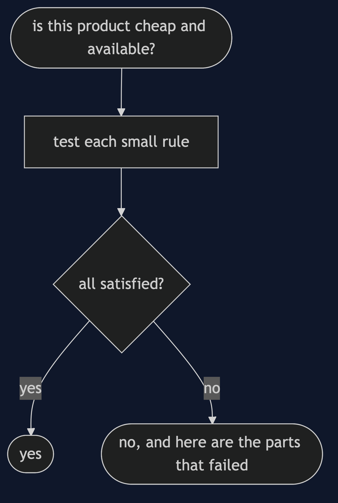
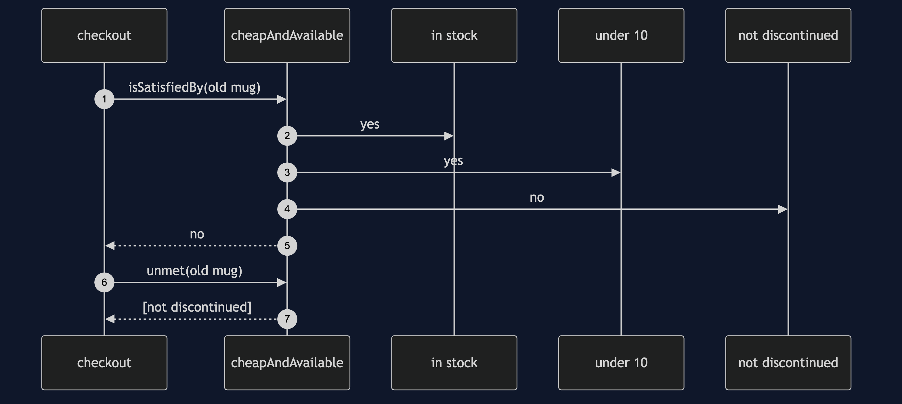

# Specification Pattern

```
src/main/java/com/jk/explore/specification/
├── SpecificationDemo.java           the six acts
│
├── domain/
│   ├── Specification.java            satisfied?, describe, unmet; and, or, not
│   ├── Products.java                 the shop's named rules, each written once
│   ├── Product.java
│   └── Catalogue.java                filters in memory, and counts what it looks at
│
└── naive/
    └── NaiveShop.java                the same rule written out three times
```

**A specification is a business rule with a name, that combines with others and can explain itself.**

This is the fourth project in [domain-driven-design-patterns](..). It builds on [Value Object](../value-object-pattern) and [Aggregate](../aggregate-pattern) in spirit: the rules that decide about a product or an order have a home of their own.

## Run

```bash
./gradlew run
```

Six acts. Every number quoted below comes from this program's own output.

```
ONE. The same rule, written three times.
  search page:   [MUG-BLUE, TEA-050]
  promotion:     [MUG-BLUE, MUG-RED, MUG-OLD, TEA-050]
  free shipping: [MUG-BLUE, TEA-050]
  the promotion includes MUG-RED at exactly 10.00 and MUG-OLD, which is discontinued. nobody meant that.
TWO. The rule, named once.
  ((in stock and under £10) and not discontinued)
  search, promotion and shipping all ask for: [MUG-BLUE, TEA-050].
  change the rule in one place and all three change.
THREE. Rules combine.
  ((a mug and under £10) or (on sale and a tea))
  [MUG-BLUE, MUG-OLD, TEA-050], in stock.
  three small rules, combined into a fourth, and no new class was written.
FOUR. A rule can say why not.
  MUG-RED: does not qualify, [under £10]
  MUG-OLD: does not qualify, [not discontinued]
  MUG-GREEN: does not qualify, [in stock]
  MUG-BLUE: qualifies
  the same object that decides can explain, so an error message is not written by hand.
FIVE. The same rule, two jobs.
  to select: [MUG-BLUE, TEA-050].
  to validate one product a customer picked, MUG-OLD: refused, [not discontinued].
  one definition of cheap and available, used to filter a list and to check a single choice.
SIX. The bill.
  10000 products. matches: 66. products looked at to find them: 10000.
  an in-memory specification looks at everything. to ask the database instead, the rule must be turned into a query.
  and for a rule used in one place, a plain lambda in the filter is simpler than a specification.
```

## Test

```bash
./gradlew test
```

3 test classes, 10 test methods, offline, with nothing installed and no framework.

## Technologies and versions

| What | Version | Why it is here |
| --- | --- | --- |
| Java | 21 | The repository standard, via the Gradle toolchain block |
| Gradle | 9.2.1 | The wrapper in this directory; no separate install needed |
| JUnit 5 | 5.10.2 | Test runner |

No framework. A hand-built project stays plain Java so the mechanism is the whole lesson.

## Learning Material

| Document | What it covers |
| --- | --- |
| [`docs/problem-statement.md`](docs/problem-statement.md) | Cheap and available, and where it lives |
| [`docs/specification-pattern-explained.md`](docs/specification-pattern-explained.md) | The pattern, and six acts |
| [`docs/class-diagram.md`](docs/class-diagram.md) | The types |
| [`docs/architecture-diagram.md`](docs/architecture-diagram.md) | One rule, three features |
| [`docs/data-flow-diagram.md`](docs/data-flow-diagram.md) | How a rule decides and explains |
| [`docs/sequence-diagram.md`](docs/sequence-diagram.md) | Written for a listener with the screen off |
| [`docs/uml-diagram.md`](docs/uml-diagram.md) | Four sequences |
| [`docs/animation.html`](docs/animation.html) | The six acts in a browser |
| [`docs/prerequisites.md`](docs/prerequisites.md) | What you need to know |
| [`docs/session.md`](docs/session.md) | A one-hour taught session |
| [`docs/spec.md`](docs/spec.md) | The generated specification |
| [`docs/youtube.md`](docs/youtube.md) | Title, description and chapters |

### The pattern in one picture


### Where each piece sits


### How one request moves



### Who calls whom, in order



### All four sequences


### Video

Built from [`video/scenes.py`](video/scenes.py) by
[`video/build_video.sh`](video/build_video.sh). The rendered file is not
committed; see the repository README for why.

## Where you have already met this

`java.util.function.Predicate` composes with `and`, `or` and `negate`. Spring Data JPA's `Specification` is the pattern, turned into a database query.

## When this is too much

For a condition used once, a lambda is clearer. A specification earns its place when a rule is shared, combined, or must explain itself.

## Where this sits

This is the fourth project in [`domain-driven-design-patterns`](..). It follows [Domain Event](../domain-event-pattern). It is close kin to the [Strategy](../../behavioural/strategy-pattern) pattern, which chooses how to do something, where a specification decides whether something qualifies.
