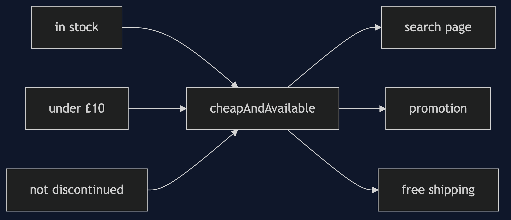
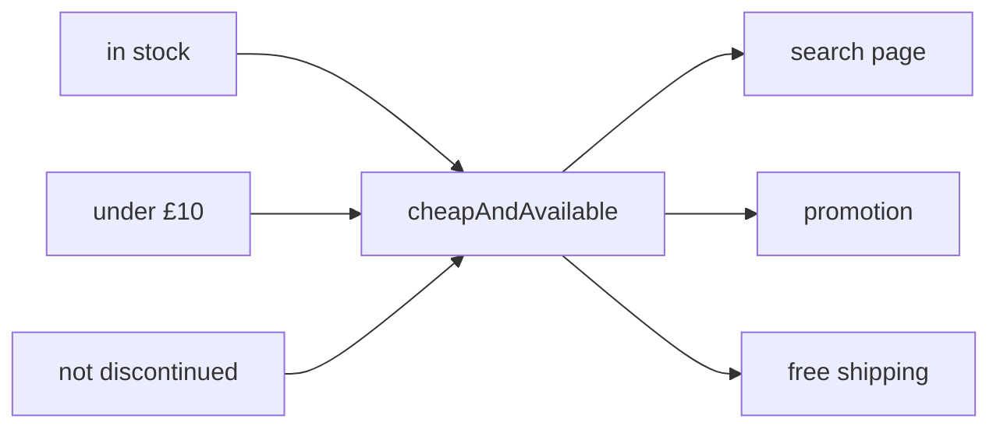

# Specification Pattern — Architecture Diagram

One named rule, used by every feature that needs it.

Mermaid source

```mermaid
flowchart LR
    R["cheapAndAvailable"] --> S["search page"]
    R --> P["promotion"]
    R --> F["free shipping"]
    I["in stock"] --> R
    U["under £10"] --> R
    N["not discontinued"] --> R
```

