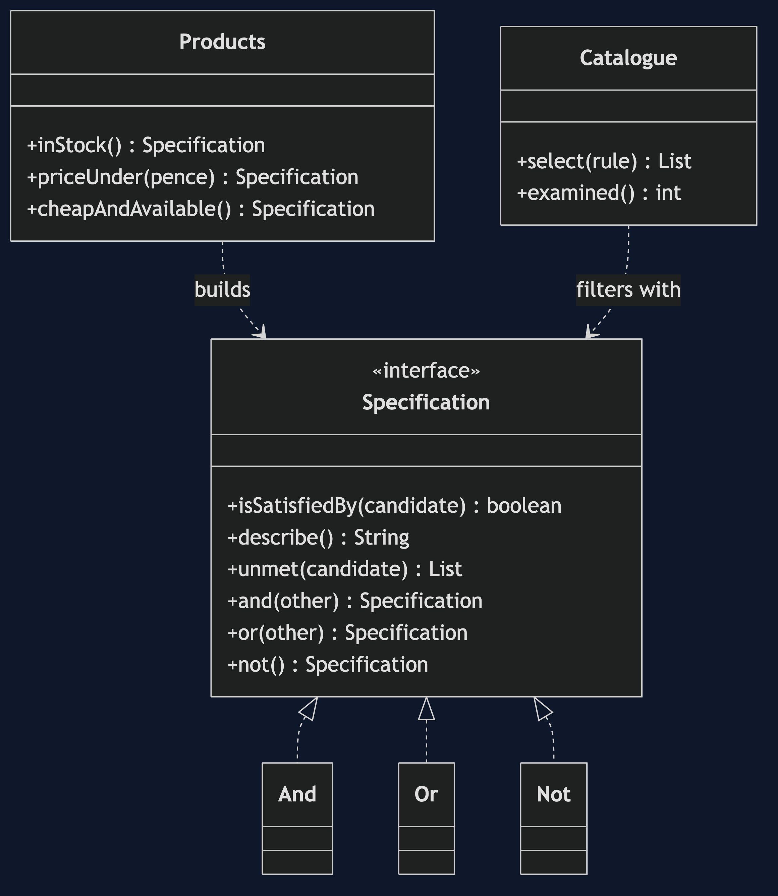
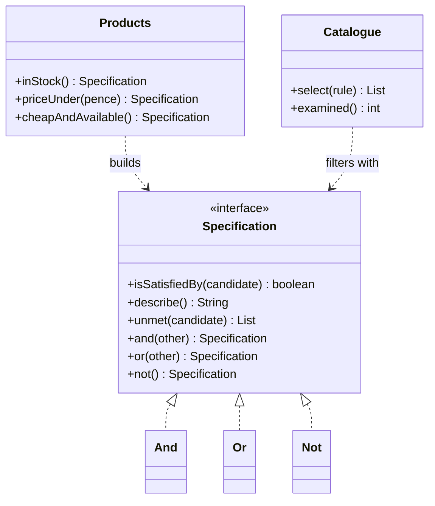

# Specification Pattern — Class Diagram

A rule is an object that combines with other rules.

Mermaid source

```mermaid
classDiagram
    class Specification {
        <<interface>>
        +isSatisfiedBy(candidate) boolean
        +describe() String
        +unmet(candidate) List
        +and(other) Specification
        +or(other) Specification
        +not() Specification
    }
    class And
    class Or
    class Not
    class Products {
        +inStock() Specification
        +priceUnder(pence) Specification
        +cheapAndAvailable() Specification
    }
    class Catalogue {
        +select(rule) List
        +examined() int
    }
    Specification <|.. And
    Specification <|.. Or
    Specification <|.. Not
    Products ..> Specification : builds
    Catalogue ..> Specification : filters with
```

