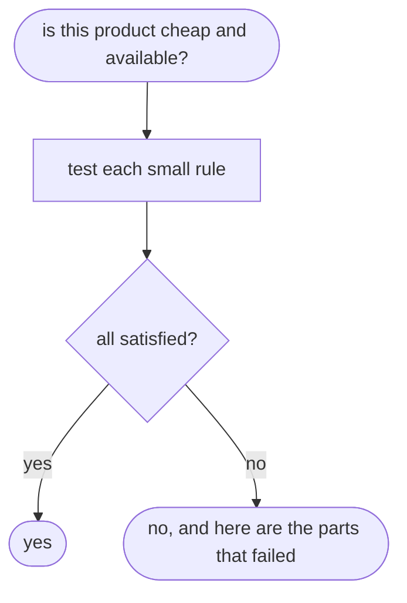

# Specification Pattern — Data Flow Diagram

How a rule decides and explains.

Mermaid source

```mermaid
flowchart TD
    Ask(["is this product cheap and available?"])
    Test["test each small rule"]
    All{"all satisfied?"}
    Yes(["yes"])
    No(["no, and here are the parts that failed"])
    Ask --> Test --> All
    All -- yes --> Yes
    All -- no --> No
```

