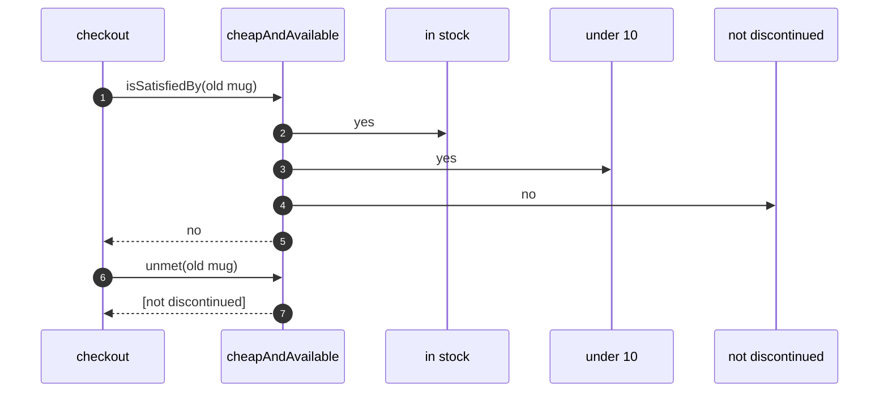

# Specification Pattern — Sequence Diagram

Written for a listener with the screen off.

Say it in words. A customer picks the old mug. The checkout asks the cheap and available rule whether the mug satisfies it. The rule asks each of its three small rules. In stock says yes. Under ten pounds says yes. Not discontinued says no, because the mug is discontinued. The rule answers no, and lists just that one part, so the checkout can show it as the reason.

Mermaid source

The load-bearing sentence: **the rule that decides is the rule that explains.**
