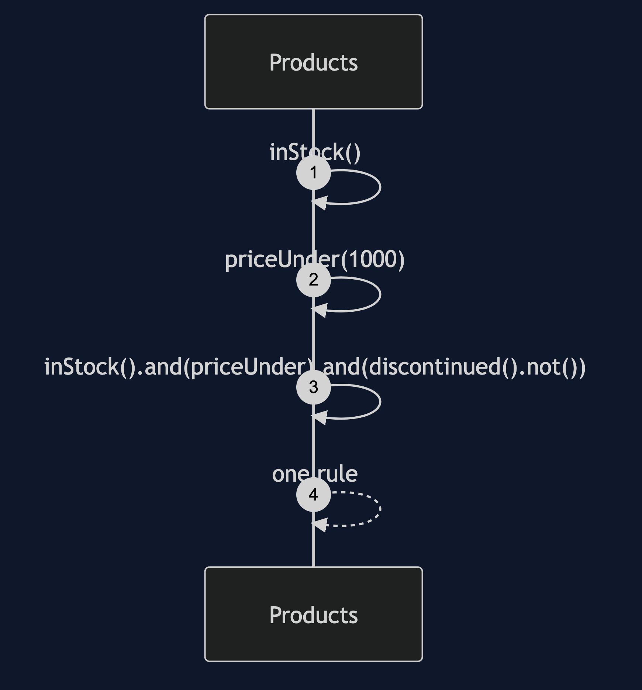
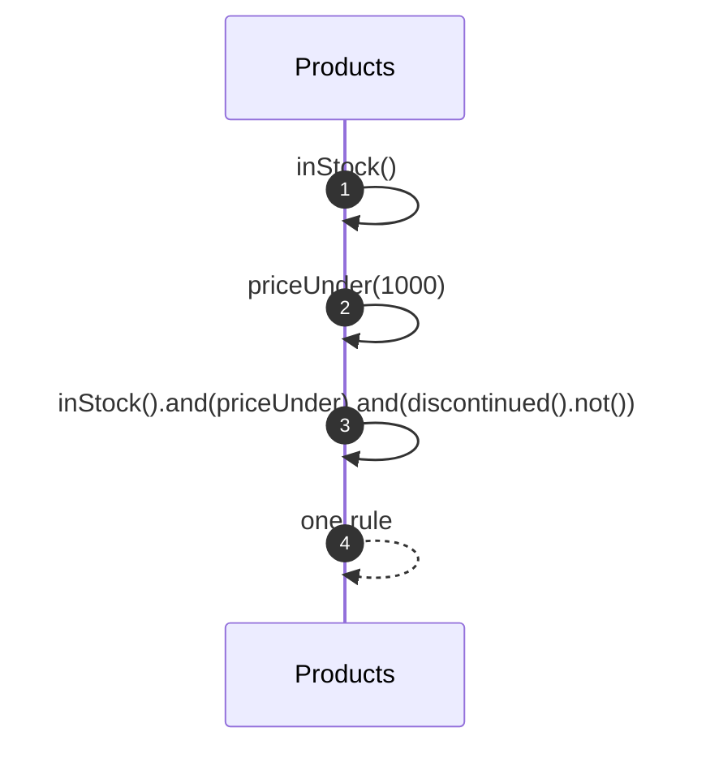
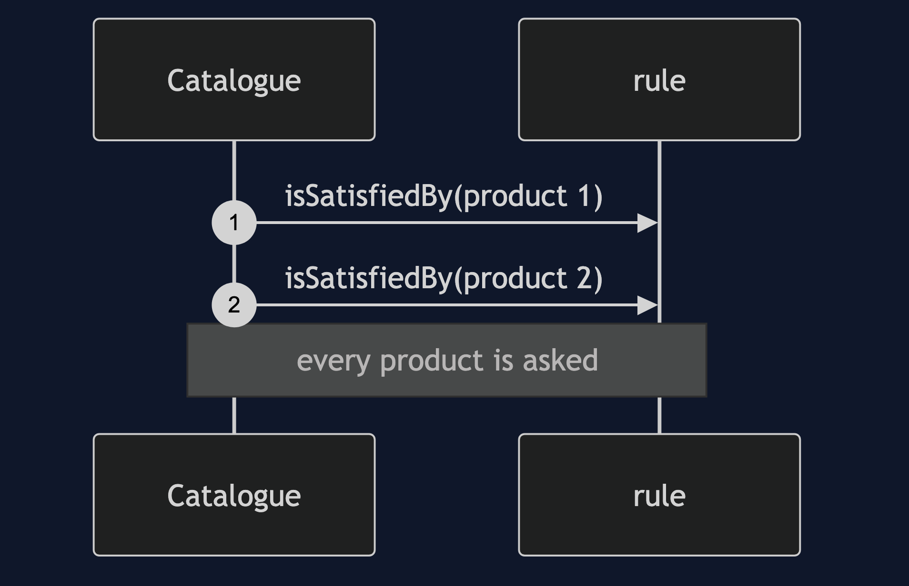
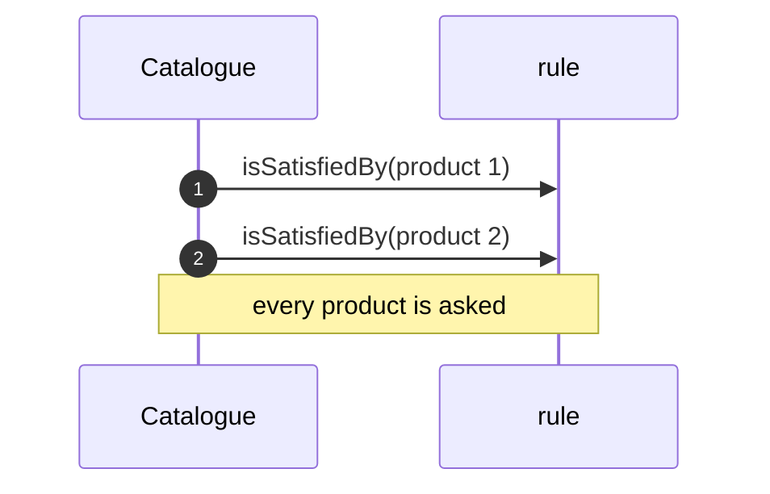

# Specification Pattern — UML Sequence Diagrams

Four sequences.

## 1. Building A Rule

Mermaid source

```mermaid
sequenceDiagram
    autonumber
    participant B as Products
    B->>B: inStock()
    B->>B: priceUnder(1000)
    B->>B: inStock().and(priceUnder).and(discontinued().not())
    B-->>B: one rule
```

## 2. Selecting

Mermaid source

```mermaid
sequenceDiagram
    autonumber
    participant C as Catalogue
    participant R as rule
    C->>R: isSatisfiedBy(product 1)
    C->>R: isSatisfiedBy(product 2)
    Note over C,R: every product is asked
```

