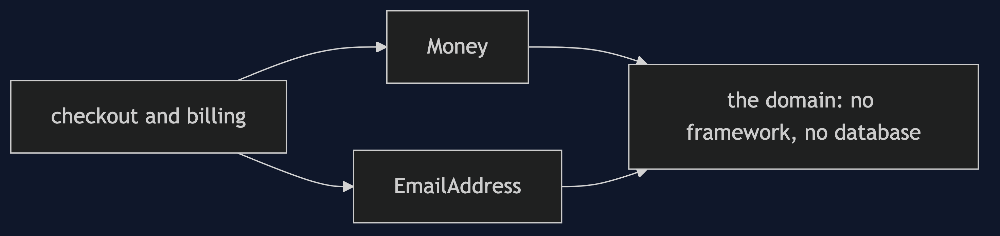
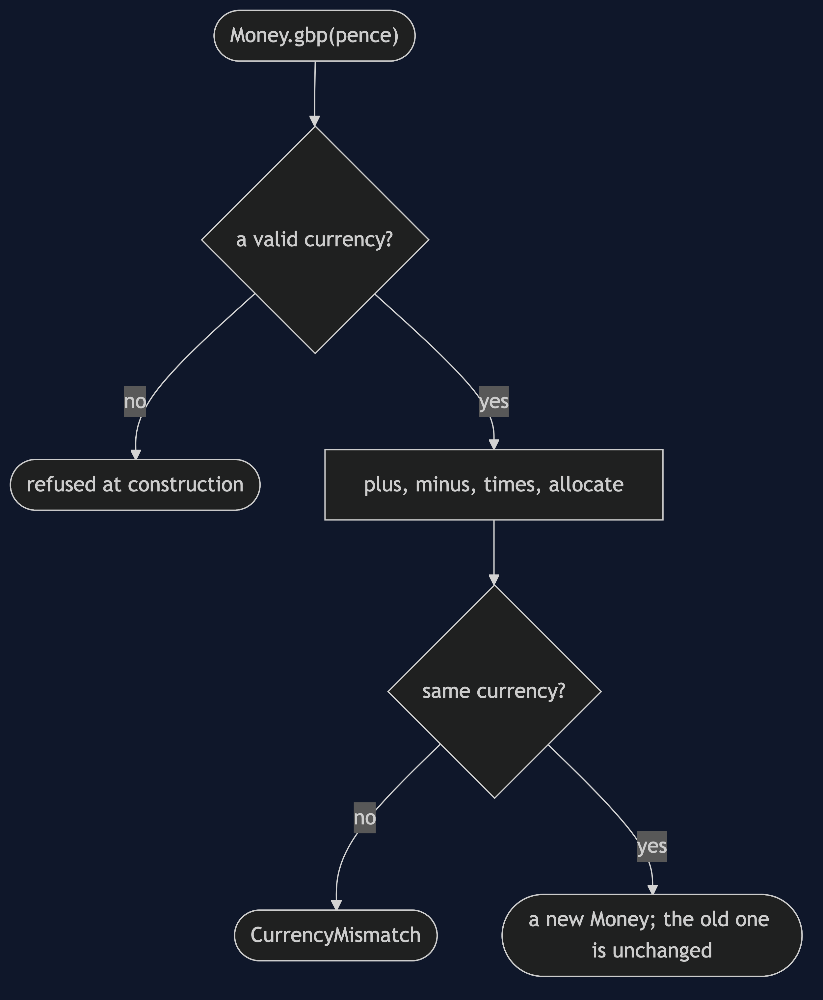
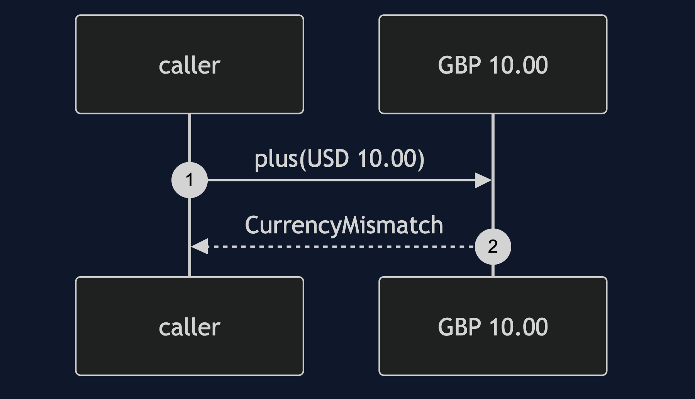
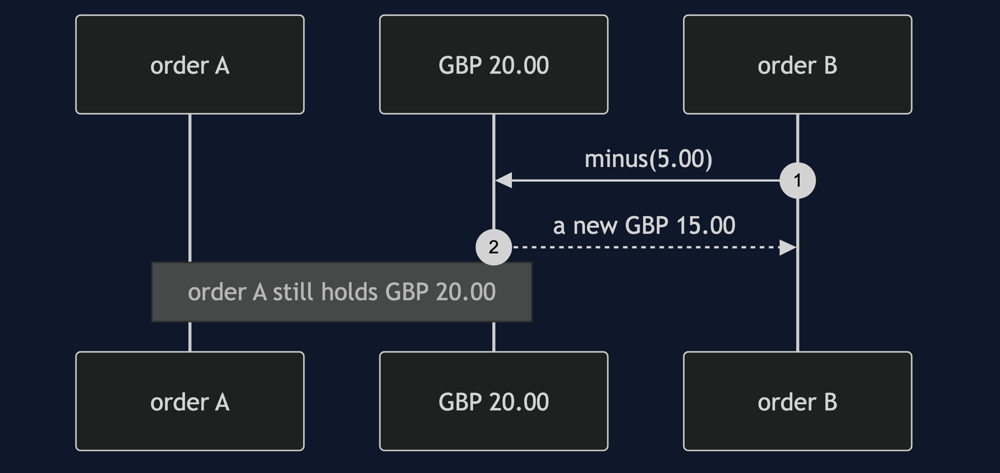
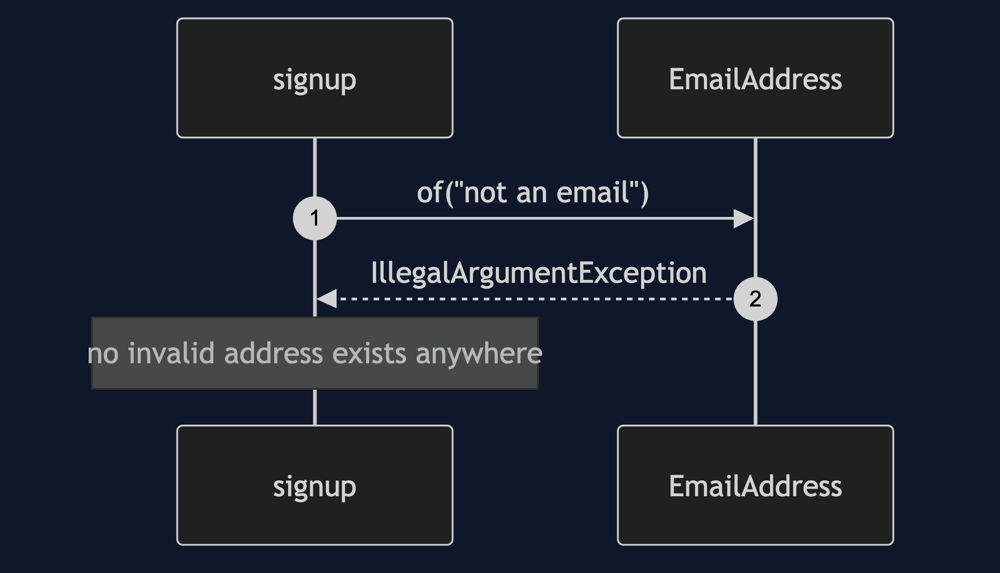
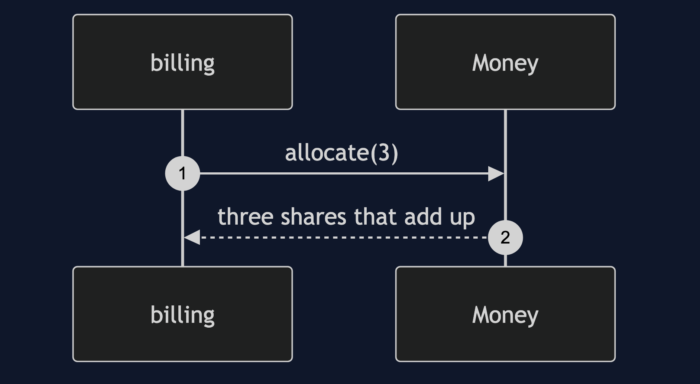

# Value Object Pattern

```
src/main/java/com/jk/explore/valueobject/
├── ValueObjectDemo.java             the six acts
│
├── domain/
│   ├── Money.java                    pence and a currency, together; plus, minus, times, allocate
│   ├── EmailAddress.java             valid from the moment it exists
│   └── CurrencyMismatch.java
│
└── naive/
    ├── NaivePricing.java             doubles, and a currency string beside the number
    ├── MutableMoney.java             a price that can be changed in place
    ├── IdentityMoney.java            equal only to itself
    └── BareEmailSignup.java          emails as strings, checked in two of three places
```

**A value object is defined by what it holds, never changes, and cannot be built wrong.**

This is the first project in [domain-driven-design-patterns](..), whose subject is writing code that says what the business says. The pattern is the smallest in the category, and the one the others are built from: an aggregate is made of value objects, and an event carries them.

## Run

```bash
./gradlew run
```

Six acts. Every number quoted below comes from this program's own output.

```
ONE. Money as a double.
  three stamps at 1.10: 3.3000000000000003.
  0.1 + 0.2 == 0.3: false.
  ten pounds added to ten dollars: 20.0.
  the number has no idea what it is a number of.
TWO. Money as a value.
  three stamps at GBP 1.10: GBP 3.30.
  ten pounds plus ten dollars: refused, cannot combine GBP with USD.
  the amount and its currency travel together.
THREE. Equal by value.
  three separate objects of 5.00, in a set: 1.
  the same with a class that compares by identity: 3.
  true for two 5.00s, and false for 5.00 and 5.00 dollars.
FOUR. Never changed.
  a mutable price shared by two orders. order B takes 5.00 off. order A now costs: 1500 pence, not 2000.
  the same with values: order B pays GBP 15.00, order A still pays GBP 20.00.
FIVE. Valid from the moment it exists.
  strings: two methods checked, the third did not. stored: [ada@example.com, not an email].
  an EmailAddress: not an email address: not an email. it cannot be built wrong.
  a method that receives an EmailAddress never checks. ada@example.com.
SIX. Splitting is a decision.
  ten pounds three ways, rounded: 3.33 + 3.33 + 3.33 = 9.99. a penny vanished.
  allocated: [GBP 3.34, GBP 3.33, GBP 3.33], adding up to GBP 10.00.
  the type has to say who gets the odd penny. that is a rule, and it lives in one place.
```

## Test

```bash
./gradlew test
```

4 test classes, 17 test methods, offline, with nothing installed and no framework.

## Technologies and versions

| What | Version | Why it is here |
| --- | --- | --- |
| Java | 21 | The repository standard, via the Gradle toolchain block |
| Gradle | 9.2.1 | The wrapper in this directory; no separate install needed |
| JUnit 5 | 5.10.2 | Test runner |

No framework. A hand-built project stays plain Java so the mechanism is the whole lesson.

## Learning Material

| Document | What it covers |
| --- | --- |
| [`docs/problem-statement.md`](docs/problem-statement.md) | Money as a number, and how it goes wrong |
| [`docs/value-object-pattern-explained.md`](docs/value-object-pattern-explained.md) | The pattern, and six acts |
| [`docs/class-diagram.md`](docs/class-diagram.md) | The types |
| [`docs/architecture-diagram.md`](docs/architecture-diagram.md) | A value at the centre of the domain |
| [`docs/data-flow-diagram.md`](docs/data-flow-diagram.md) | How an amount is made, combined and split |
| [`docs/sequence-diagram.md`](docs/sequence-diagram.md) | Written for a listener with the screen off |
| [`docs/uml-diagram.md`](docs/uml-diagram.md) | Four sequences |
| [`docs/animation.html`](docs/animation.html) | The six acts in a browser |
| [`docs/prerequisites.md`](docs/prerequisites.md) | What you need to know |
| [`docs/session.md`](docs/session.md) | A one-hour taught session |
| [`docs/spec.md`](docs/spec.md) | The generated specification |
| [`docs/youtube.md`](docs/youtube.md) | Title, description and chapters |

### The pattern in one picture


### Where each piece sits



### How one request moves



### Who calls whom, in order


### All four sequences









### Video

Built from [`video/scenes.py`](video/scenes.py) by
[`video/build_video.sh`](video/build_video.sh). The rendered file is not
committed; see the repository README for why.

## Where you have already met this

`java.time.LocalDate`, `BigDecimal`, `UUID`, `String`. Every one of them is defined by its contents, never changes, and is compared by value.

## When this is too much

For a value that means nothing beyond its raw type, such as a loop counter or a name shown on a screen, a wrapper is noise. It earns its place where mistakes are expensive and rules exist.

## Where this sits

This is the first project in [`domain-driven-design-patterns`](..). The pattern is the building block of the next two, [Aggregate](../aggregate-pattern) and [Domain Event](../domain-event-pattern).
