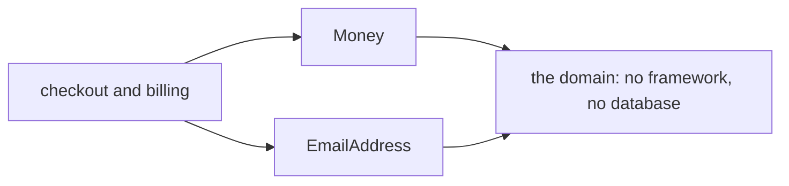

# Value Object Pattern — Architecture Diagram

Value objects sit in the domain, and everything else uses them.

Mermaid source

```mermaid
flowchart LR
    S["checkout and billing"] --> M["Money"]
    S --> E["EmailAddress"]
    M --> D["the domain: no framework, no database"]
    E --> D
```

