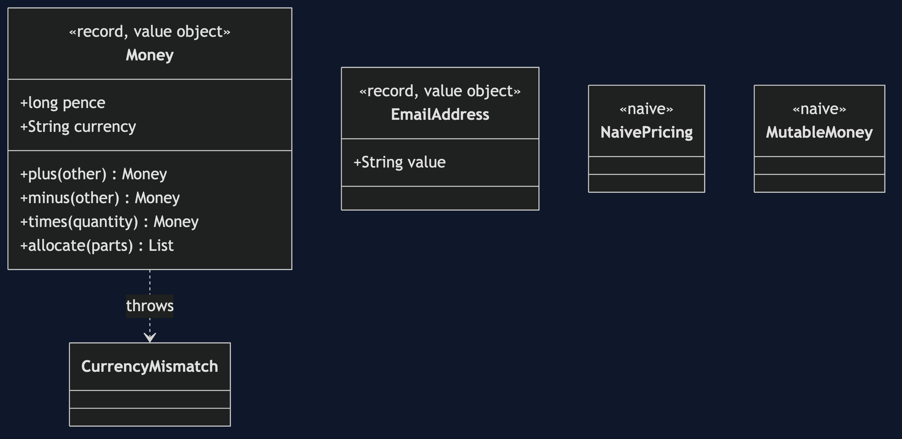
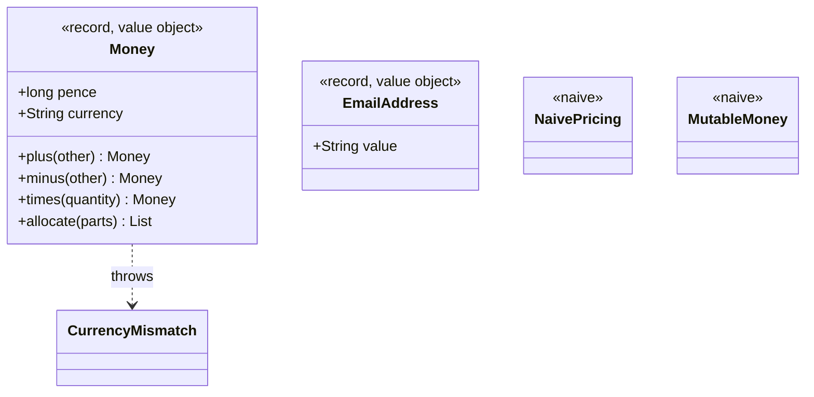

# Value Object Pattern — Class Diagram

Two small types at the centre of the domain, and the plain versions beside them for contrast.

Mermaid source

```mermaid
classDiagram
    class Money {
        <<record, value object>>
        +long pence
        +String currency
        +plus(other) Money
        +minus(other) Money
        +times(quantity) Money
        +allocate(parts) List
    }
    class EmailAddress {
        <<record, value object>>
        +String value
    }
    class CurrencyMismatch
    class NaivePricing {
        <<naive>>
    }
    class MutableMoney {
        <<naive>>
    }
    Money ..> CurrencyMismatch : throws
```

