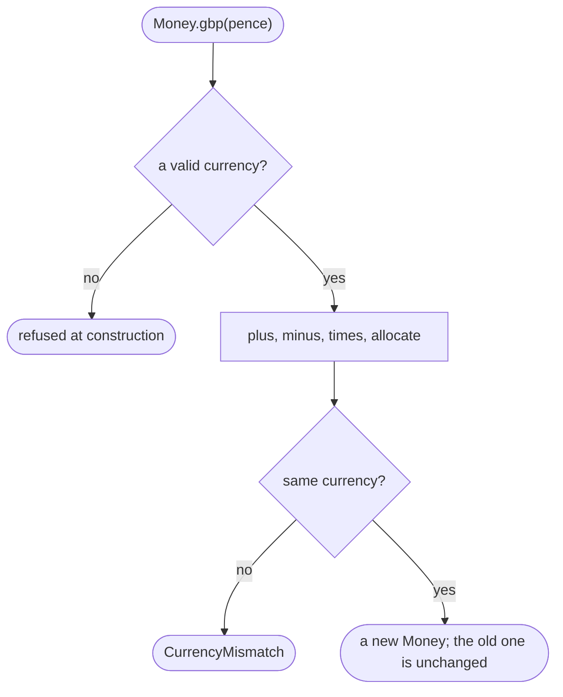

# Value Object Pattern — Data Flow Diagram

How an amount is made and combined.

Mermaid source

```mermaid
flowchart TD
    Make(["Money.gbp(pence)"])
    Ok{"a valid currency?"}
    Bad(["refused at construction"])
    Combine["plus, minus, times, allocate"]
    Mix{"same currency?"}
    Refuse(["CurrencyMismatch"])
    New(["a new Money; the old one is unchanged"])
    Make --> Ok
    Ok -- no --> Bad
    Ok -- yes --> Combine --> Mix
    Mix -- no --> Refuse
    Mix -- yes --> New
```

